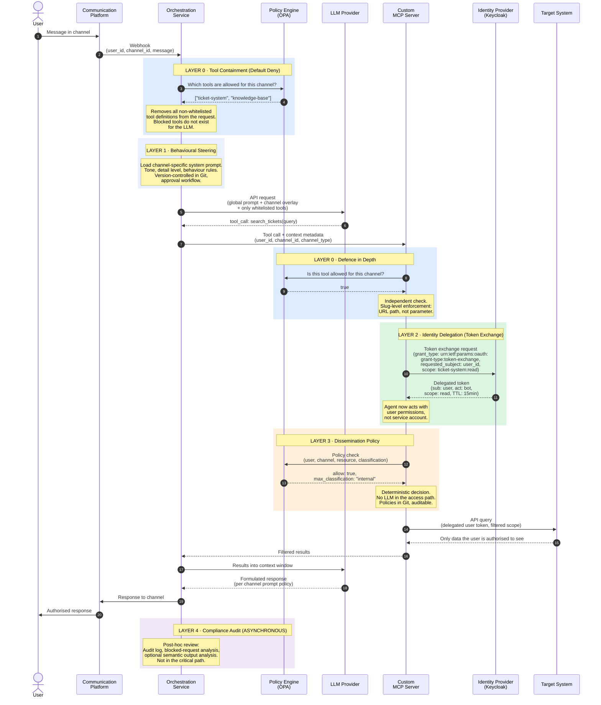
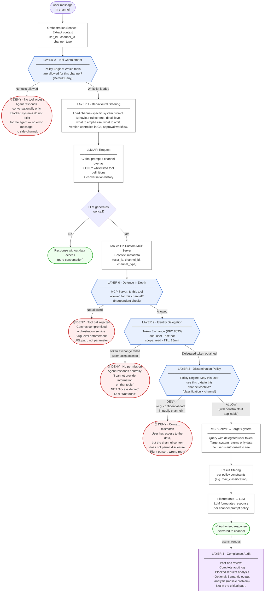

# Dissemination Control for AI Agents
## Architecture Blueprint: Context-Aware Governance with Identity Delegation

**Version:** 0.5 — Reference Architecture  
**Author:** Andre Jahn, Jahn Consulting  
**Date:** March 2026  
**License:** CC BY-SA 4.0

---

## Abstract

AI agents in enterprise environments access data sources and communicate across channels with different audiences. Existing security models cover authentication and authorisation but do not address a third question: **Which of the accessed data may the agent share in which context?**

This blueprint defines an architecture for Dissemination Control — a governance layer that ensures AI agents follow context-dependent rules about what information they may reveal, to whom, and through which channel. It is vendor-neutral, builds on existing IAM infrastructure, and requires no global data classification effort.

The architecture has been validated on a live reference environment with real integrations and is designed for incremental adoption — from basic tool containment to full identity delegation with policy-engine integration.

---

## The Problem

### The Three-Layer Gap

| Layer | Question | Status |
|---|---|---|
| Authentication | Who is the agent? | Solved (OAuth2, service accounts) |
| Authorisation | What may it access? | Solved (IAM, RBAC, ABAC) |
| **Dissemination Control** | **What may it say where?** | **Open** |

Authentication and authorisation are well-understood problems with mature solutions. Dissemination Control is not. It addresses a fundamentally different question: not whether the agent *can* access data, but whether it *should share* that data in a given context.

### Why Existing Models Do Not Solve This

A human employee with access to HR data and project data does not post salary information in the public team channel. Not because IAM prevents it — they have read access — but because they understand the social context.

AI agents decide based on **relevance**, not **confidentiality**. The most helpful answer to a harmless question is often the one containing sensitive information. This is not a bug in the model. It is a structural mismatch between how LLMs optimise (maximise helpfulness) and how organisations need information to flow (minimise inappropriate disclosure).

### Why This Matters Now

Three trends are converging:

1. **MCP (Model Context Protocol) is becoming the standard for tool integration.** Agents are no longer limited to text generation — they call APIs, query databases, create tickets, and modify documents.
2. **Agents are being deployed in multi-user, multi-channel environments.** The same agent serves public channels, internal team channels, and private messages — each with different confidentiality expectations.
3. **Off-the-shelf MCP servers use single-identity, full-access tokens.** They have no concept of per-user permissions, channel context, or dissemination policy. Every tool call runs with the same god-mode credentials.

The attack surface is expanding faster than governance frameworks can keep up. Guardrail providers (Lakera, Prompt Armor, et al.) protect the model — input validation, prompt injection detection, output filtering. They do not address the infrastructure-level question: **How does the agent fit into your existing identity, permission, and compliance landscape?**

### Typical Failure Scenario

An AI bot with access to a ticket system operates in a team communication platform. In a public channel, someone asks "How is the project going?" — the bot delivers a helpful summary including confidential budget details and personnel decisions. Not because it was compromised, but because it was trying to be helpful. No prompt injection, no jailbreak, no vulnerability. Just an agent doing exactly what it was designed to do, in a context where it should not.

---

## Architecture Overview

### Core Principle

The agent does not have permissions. The **task** has permissions. The agent acts on behalf of a specific user, inherits that user's permissions via delegation, and data access is scoped per request to the relevant context. What the agent cannot see, it cannot leak.

### Design Principles

1. **Default Deny / Whitelist** — No tool, no system, no data source is available until explicitly enabled for a given context. Do not filter results — prevent requests. What is not whitelisted does not exist for the agent.
2. **No global data classification required** — Permissions are derived from existing IAM structures. Existing project roles, group memberships, and access policies serve as implicit classification.
3. **User identity, not bot identity** — The agent inherits the requesting user's permissions via token exchange, not a service account with broad access.
4. **Task-scoped tokens** — Short-lived, purpose-bound credentials instead of persistent god-mode tokens.
5. **Defence in depth** — Multiple independent enforcement points. If one is bypassed, the next catches it.
6. **Existing infrastructure, new wiring** — No new products. The architecture composes existing components (identity providers, policy engines, API gateways) in a new pattern.
7. **Explicit enablement, auditable by design** — Every tool enablement for a given context requires approval, is version-controlled, and produces an audit trail automatically.

---

## Governance Layers

The architecture defines five governance layers. Not every organisation needs all five. The layers are ordered by implementation complexity and can be adopted incrementally.

### Layer 0: Tool Containment (Default Deny)

**What it does:** Controls which tools the agent can see and invoke, per context. Tools not on the whitelist are removed from the LLM request entirely — the agent does not know they exist.

**Why it matters:** This is the most effective single measure against information leakage. If the agent cannot call the HR system, it cannot leak HR data. No request means no leak, no error message, no side channel revealing that the system exists.

**How it works:**

1. Before each LLM request, the orchestration service queries the policy engine: "Which tools are allowed for this channel?"
2. Only whitelisted tool definitions are included in the LLM request. All others are omitted.
3. The agent operates in a world where blocked systems do not exist.
4. As defence in depth, the MCP server validates the whitelist again on every incoming tool call — even if the orchestration service is compromised.

**Enforcement mechanism:** Policy engine rules (e.g., OPA/Rego), evaluated at the orchestration service and again at the MCP server. Both checks are mandatory.

**Slug-level enforcement:** Tool identifiers are embedded directly in MCP server URL paths (API slugs), not passed as string parameters. This prevents prompt-based circumvention — an attacker who manipulates the agent's tool-call parameters cannot redirect requests to a different system because the target system is determined by the URL route, not by a parameter the LLM controls.

```
Channel: #sales-team
  Allowed tools: [ticket-system, knowledge-base]
  Blocked tools: [hr-system, finance-system, code-repository]
  → Agent sees only ticket-system and knowledge-base
  → Agent cannot reference, query, or acknowledge hr-system

Channel: direct-message
  Allowed tools: [ticket-system, knowledge-base, hr-system(own-data)]
  → Agent can access HR data, but only the requesting user's own records
```

### Layer 1: Behavioural Steering (Prompt Policy)

**What it does:** Controls how the agent behaves within its permitted tool and identity scope. This is not configuration — it is a formal governance layer that sits between tool containment and identity delegation.

**Why it matters:** Tool containment controls what the agent *can do*. Behavioural steering controls what it *chooses to do* within those boundaries. An agent with access to a ticket system can still be overly verbose, share more detail than appropriate for the channel, or adopt a tone that is inappropriate for the audience.

**How it works:**

A two-level prompt system:

1. **Global system prompt** — Defines the agent's base personality, safety constraints, and organisation-wide policies. Applies to all channels.
2. **Channel-specific prompt overlays** — Define context-appropriate behaviour: level of detail, tone, what to emphasise, what to omit. A public channel gets a concise, non-technical persona. An engineering channel gets a detailed, technical one. A direct message can be more personal and comprehensive.

**Governance model:** The global prompt is controlled by the platform administrator. Channel-specific overlays can be delegated to channel owners within boundaries defined by the admin layer — self-service within guardrails.

**This is not just "prompt engineering."** It is a policy layer with version control, audit trail, and approval workflows. Changes to the global prompt or channel overlays follow the same governance process as tool enablement changes. They are stored in Git, reviewed, and deployed through the same pipeline as policy-engine rules.

### Layer 2: Identity Delegation

**What it does:** Ensures that every data access happens with the requesting user's permissions, not the agent's service account.

**Why it matters:** Without identity delegation, the agent operates with a single set of credentials — typically a service account with broad read access. This means every user gets the same data, regardless of their actual permissions. Identity delegation ensures that when user A asks a question, the agent queries the target system as user A, and the target system's native permission model determines what data is returned.

**How it works:**

1. The orchestration service authenticates the requesting user via the communication platform.
2. For each tool call, the MCP server performs a token exchange with the identity provider: "Issue a short-lived token for user A, scoped to read access on the ticket system."
3. The identity provider validates: Is the agent allowed to act on behalf of user A? Does user A have access to the requested system?
4. The MCP server uses the delegated token to query the target system. The target system returns only data that user A is authorised to see.

**Token properties:**
- Subject: The requesting user (not the bot)
- Actor: The agent service (for audit trail)
- Scope: Minimal necessary (e.g., read-only on a specific system)
- TTL: Short-lived (e.g., 15 minutes)

**Standard:** OAuth 2.0 Token Exchange (RFC 8693). Supported by most enterprise identity providers (Keycloak, Entra ID, Okta, Auth0).

**Information disclosure prevention:** When a user lacks access, the agent responds with a neutral message ("I cannot provide information on that topic") — not "access denied" (confirms the resource exists) and not "not found" (misleading). The specific wording is a policy decision per deployment.

### Layer 3: Dissemination Policy Engine

**What it does:** Enforces context-dependent rules about what data may be shared in which channel, beyond what tool containment and identity delegation provide.

**Why it matters:** Tool containment is coarse-grained (system-level visibility). Identity delegation is user-scoped (what the user can see). Dissemination policy is context-scoped: even if the user has access to confidential data, should it be surfaced in a public channel?

**How it works:**

The MCP server queries the policy engine with the full context — user identity, channel, requested resource, resource classification — and receives a decision: allow, deny, or allow with constraints.

```
Input:
  user: user-a
  channel: public-channel
  resource: ticket SALES-2026
  classification: internal

Policy evaluation:
  → Public channels may only surface data classified as "public"
  → SALES-2026 is classified as "internal"
  → Decision: DENY

Same request, private channel:
  → Private channels may surface "public" and "internal" data
  → Decision: ALLOW
```

**Policy expression:** Policies are written as code (e.g., Rego for OPA), stored in Git, version-controlled, and deployed through CI/CD. This makes every policy change auditable and reversible. The policy engine makes deterministic decisions — no LLM involved in the access control path.

**Key distinction from Layer 0:** Tool containment is binary — the tool exists or it does not. Dissemination policy is graduated — the tool exists, but its responses are filtered based on context. Both are necessary. Tool containment prevents the request; dissemination policy filters the result.

### Layer 4: Compliance Audit (Async)

**What it does:** Provides asynchronous monitoring, audit logging, and — for high-security environments — semantic output analysis.

**Why it matters:** Layers 0–3 are preventive. Layer 4 is detective. It catches what the preventive layers missed, provides the evidence trail for compliance audits, and enables continuous improvement of the policy set.

**Components:**

- **Audit log:** Every tool call, every policy decision (allow and deny), every token exchange. Who asked, which channel, which tool, what was returned, what was blocked. This log is the compliance backbone.
- **Blocked-request logging:** Denied requests are logged with full context. This serves two purposes: security monitoring (detecting probing attempts) and policy tuning (identifying overly restrictive rules).
- **Semantic output analysis (optional, high-security):** A separate LLM reviews agent responses asynchronously for policy violations that the rule-based layers cannot catch — e.g., the agent inferring confidential information from public data (the mosaic problem). This is an escalation layer, not a blocking layer. It flags for human review.

---

## Three-Tier Governance Model

The five layers above describe *what* is enforced. The governance model describes *who controls what*.

### Admin Tier

The platform administrator defines the boundaries:

- Which channels exist and what their security classification is
- Which tools are available in the platform at all (the global tool catalogue)
- The global system prompt and non-negotiable safety constraints
- Which policy rules apply organisation-wide
- Who may approve tool enablement requests

### User Tier (Self-Service Within Boundaries)

Channel owners and team leads operate within the boundaries set by the admin tier:

- Request tool enablement for their channel (subject to approval workflow)
- Customise the channel-specific prompt overlay within admin-defined guardrails
- Configure notification preferences for their channel's agent interactions

**The principle:** The admin tier defines the ceiling. The user tier configures the room within that ceiling. A channel owner cannot enable a tool that the admin has not made available, and cannot override the global prompt's safety constraints.

### IAM Tier (Hard Ceiling)

The identity provider and target system permissions form the ultimate enforcement boundary. Even if a tool is enabled for a channel and the user requests data they are interested in, the target system only returns what the user's IAM permissions allow. This is not a new policy layer — it is the existing enterprise permission model, now properly delegated to the agent via token exchange.

```
Admin tier:     "Ticket system is available for the sales channel"
User tier:      "Enable ticket system for #sales-team" (approved)
Prompt policy:  "In #sales-team, provide concise status updates, no budget details"
IAM tier:       "User A has read access to projects SALES-2026 and MARKETING-Q1"
                "User B has read access to MARKETING-Q1 only"

Result: Same channel, same question, different answers — 
        and the agent's tone matches the channel's purpose.
```

---

## Component Architecture

The architecture comprises six component roles. Each role can be fulfilled by different products depending on the organisation's existing infrastructure.

### Communication Platform
The channel through which users interact with the agent. Provides user identity, channel context, and message routing.

### Orchestration Service
The central coordination layer. Receives user messages, resolves context (user, channel), queries the policy engine for tool permissions, constructs the LLM request with only permitted tools, and routes tool calls to the appropriate MCP server.

### LLM Provider
The language model that generates responses and tool calls. Receives only the tools and data that the governance layers have approved. It operates in a constrained world — what it cannot see, it cannot leak.

### Custom MCP Server (Policy Enforcement Point)
The critical enforcement layer. Sits between the LLM's tool calls and the target systems. Performs defence-in-depth whitelist validation, token exchange, scope filtering, and policy-engine queries. This component *must* be custom-built — off-the-shelf MCP servers lack identity delegation, context awareness, and policy integration.

### Identity Provider
Manages user identities, group memberships, and token exchange. Issues delegated tokens that allow the agent to act with a specific user's permissions for a specific scope and duration.

### Policy Engine
Evaluates context-dependent rules deterministically. Stores policies as code in version control. Provides the tool whitelist per channel, the data-level dissemination rules, and the audit log of all decisions.

### Component Interaction Flow

```
1. User sends message in a channel
   → Orchestration service receives: user identity, channel context, message

2. Orchestration service queries policy engine
   → "Which tools are allowed for this channel?"
   → Policy engine returns: [ticket-system, knowledge-base]
   → All other tools are excluded from the LLM request

3. Orchestration service constructs LLM request
   → System prompt: global + channel-specific overlay
   → Conversation history
   → ONLY permitted tool definitions
   → NO raw data from target systems

4. LLM generates tool call
   → tool: search_tickets
   → params: { query: "Project SALES-2026 status" }
   → LLM CANNOT call hr-system (not in its tool list, does not know it exists)

5. Orchestration service routes tool call to MCP server
   → Tool call parameters (from the LLM)
   → Context metadata (user identity, channel, timestamp)

6. MCP server: defence-in-depth whitelist check
   → Is "ticket-system" allowed for this channel? Yes → proceed. No → reject.
   → Enforcement at URL slug level, not parameter level

7. MCP server: token exchange with identity provider
   → "Issue a token for user-a, scoped to ticket-system:read"
   → Identity provider validates delegation permission and user access
   → Returns short-lived delegated token (TTL: 15 min)

8. MCP server: policy engine query (if Layer 3 is active)
   → "May user-a see ticket SALES-2026 in this channel context?"
   → Policy engine evaluates channel classification, resource classification
   → Returns: allow / deny / allow with constraints

9. MCP server queries target system
   → Authenticated with delegated token (user-a's permissions)
   → Target system returns only data user-a may see

10. Results return to LLM
    → Only filtered, authorised data enters the context window
    → LLM formulates response

11. Response delivered to user in the original channel
```

<details>
<summary>Sequence Diagram: Request Flow with Enforcement Points</summary>



</details>

### Divergent Scenario: User Without Access

```
User-b asks the same question in the same channel.

Step 7: Token exchange for user-b
  → Identity provider: user-b has no access to project SALES-2026
  → Token issued with restricted scope
  → Target system returns no results

Step 10-11: LLM responds:
  → "I cannot provide information on that topic."
  → NOT "You don't have access" (confirms resource exists)
  → NOT "Project not found" (misleading)
```

---

## Defence in Depth

Each enforcement point operates independently. If one layer is bypassed — through misconfiguration, compromise, or a novel attack — the next layer catches it.

```
Layer 0: Tool Containment
├── Policy engine defines which tools are visible per channel
├── Orchestration service removes non-whitelisted tools from LLM request
├── LLM does not know blocked systems exist
├── No request = no leak, no error message, no side channel
├── MCP server validates whitelist again (independent check)
├── Enforcement at URL slug level prevents parameter-based circumvention
└── New tool enablements require approval workflow

Layer 1: Behavioural Steering
├── Global system prompt defines safety boundaries
├── Channel-specific overlays control verbosity, tone, detail level
├── Prompt policies version-controlled in Git
└── Changes follow same approval process as tool enablements

Layer 2: Identity Delegation
├── Token exchange via identity provider
├── User permissions, not bot permissions
├── Short-lived, task-scoped tokens
└── Target system enforces its native permission model

Layer 3: Dissemination Policy
├── Context-dependent data filtering (channel × user × classification)
├── Deterministic policy decisions (no LLM in the access path)
├── Policies as code, auditable, version-controlled
└── Graduated: not just allow/deny, but allow-with-constraints

Layer 4: Compliance Audit
├── Complete audit log (allowed and denied requests)
├── Blocked-request analysis for security and policy tuning
└── Optional: async semantic output analysis for high-security environments
```

<details>
<summary>Flowchart: Enforcement Points and Denial Paths</summary>



</details>

### The Mosaic Problem

Individual pieces of non-sensitive information can, in combination, yield confidential conclusions. Task-scoped access mitigates this — the context window contains only task-relevant data — but does not eliminate it entirely.

**Documented residual risk:** The architecture provides the same level of protection as a competent employee who receives the right files for the right task. For most enterprise contexts, this is an acceptable and defensible risk posture. For high-security environments, Layer 4 (semantic output analysis) provides additional detection capability.

---

## Knowledge Base Scoping

AI agents frequently access shared knowledge bases (wikis, documentation systems). Without scoping, the agent can search the entire knowledge base regardless of channel context — creating a cross-channel information leakage path that bypasses tool containment.

**Solution: Collection-level scoping.** The policy engine controls not just which knowledge base the agent can access, but which collections (spaces, folders, areas) within it. The sales channel's agent can search the "Sales" and "Product" collections but not "Engineering" or "HR Policies." This is enforced at the MCP server level, not as a prompt instruction — the query to the knowledge base includes a collection filter that cannot be overridden by the LLM.

```
Channel: #sales-team
  knowledge-base access: [Sales, Product, Public]

Channel: #engineering
  knowledge-base access: [Engineering, Architecture, Public]

Channel: direct-message
  knowledge-base access: [user-scoped — all collections the user has access to]
```

---

## Channel Audience Scoping

Identity delegation (Layer 2) scopes the *query* to the requesting user's permissions. But the *response* is visible to everyone in the channel. If Anna asks about a confidential deal in a shared channel and receives details, every channel member can read the answer — including those who would not have access to the data themselves.

This is not a theoretical concern. It is the most common information leakage pattern in multi-user agent deployments: the data access is correctly scoped, but the output medium is not.

### Two Modes

The architecture defines two channel audience scoping modes. The choice between them is a policy decision per channel — not a global setting.

**Intersection Mode (conservative).** The agent may only return data that *all* channel members are authorised to see. The effective permission set is the AND-conjunction of all members' permissions — the lowest common denominator. Nothing enters the channel that any single member should not see.

This is the secure default for channels with mixed audiences: cross-functional teams, channels with external guests, or any context where the membership roster includes people with different clearance levels.

The tradeoff is restrictiveness. A single member with limited access lowers the permission ceiling for everyone. In practice, this is a feature, not a bug — it forces organisations to compose channel membership deliberately rather than defaulting to "everyone."

**Requester Mode (current model).** The agent responds based on the requesting user's permissions. More flexible, but the response is visible to all channel members, including those who would not have access to the underlying data.

This is acceptable for channels where all members have equivalent access levels — which is typically the case for well-designed team channels (the sales team channel contains sales team members, who all have access to sales data). It is not acceptable for mixed-audience channels.

### Implementation

Intersection mode requires the MCP server to know the channel's member list and resolve each member's permission set at query time. The effective permission set for the query is the intersection of all member permissions. This adds latency (one permission lookup per member) and complexity (the orchestration service must pass the member list to the MCP server).

For channels with stable membership, the intersection can be pre-computed and cached — updated only when channel membership changes. This reduces the runtime cost to a single cache lookup.

For direct messages, the distinction is irrelevant — there is only one recipient, so requester mode and intersection mode produce identical results.

### Policy Configuration

```
Channel: #town-square (public, all employees)
  audience_mode: intersection
  → Agent can only share data ALL employees may see
  → Effectively limits responses to public-classified data

Channel: #sales-team (private, sales team only)
  audience_mode: requester
  → All members have equivalent sales access
  → Requester mode is sufficient

Channel: #project-alpha (private, cross-functional)
  audience_mode: intersection
  → Mixed audience: sales, engineering, external consultant
  → Only data visible to ALL members (including the consultant) is returned

Channel: direct-message
  audience_mode: requester
  → Single recipient, modes are equivalent
```

---

## Context Window Management as a Policy Decision

In long-running sessions, the agent's context window accumulates information from previous exchanges. This creates a governance problem: data that was legitimately accessed in turn 1 may still be in the context window when a different user (in a shared channel) asks a question in turn 15.

**Active forgetting is a policy decision, not just a technical optimisation.** The architecture treats context window management as a governance concern:

- **Per-turn context isolation:** Each request is processed with a fresh context, containing only the current user's identity and current channel's permitted data. Previous turns may be included for conversational continuity but are subject to the same policy evaluation.
- **Session boundaries:** Policy defines when a session resets — per user, per time window, or per topic change.
- **Context window degradation:** As the context window fills, the quality of the agent's responses degrades. The architecture treats this as a signal for session reset, not as a problem to be solved by expanding the window.

---

## Compliance Process for Tool Enablement

When a team requires access to an additional tool in their channel:

```
1. Request
   "Channel #sales-team requires access to the CRM system 
    (scope: customer contact data, read-only)"

2. Review (data protection / CISO)
   → What data becomes accessible?
   → Is the channel's participant scope appropriate?
   → Are there regulatory constraints?

3. Approval → Policy update
   → Version-controlled in Git
   → Audit trail of the change
   → Automated deployment via CI/CD

4. Effective immediately after policy deployment
   → No code change required
   → No agent restart required
   → Rollback via Git revert if needed
```

This process creates compliance by design: every tool enablement is documented, approved, and traceable. The audit trail is a natural byproduct of the Git-based policy deployment pipeline.

---

## Why Not Off-the-Shelf MCP Servers?

Off-the-shelf MCP servers (e.g., vendor-provided connectors for ticket systems, wikis, CRMs) typically use a single API token with broad access. They provide:

- No identity delegation (every user gets the same data)
- No scope filtering per request
- No context awareness (channel, audience, classification)
- No policy integration

They are suitable for single-user development environments and prototyping. For controlled data flows in multi-user enterprise environments, custom MCP servers with built-in policy enforcement are necessary.

**The architectural investment is in the MCP server layer** — this is where identity delegation, defence-in-depth validation, and policy-engine integration live. The orchestration service and policy engine are relatively straightforward. The MCP server is the component that makes or breaks the governance model.

---

## Adoption Tiers

Not every organisation needs the full architecture. The layers are designed for incremental adoption. Each tier adds exactly one governance capability to the previous one. This is critical: security is not all-or-nothing. Each step delivers measurable risk reduction, and the first step can be implemented in days.

### Baseline: Ungoverned (the status quo)

This is how most enterprises currently operate AI agents. A service account with broad access. All tools visible. All data returned to all users. The agent decides what to share based on relevance, not confidentiality. This is the default when using off-the-shelf MCP servers with a single API token.

**Risk profile:** Any user can receive any data the agent can access. Information leakage is not a possibility — it is the normal operating mode. The agent will helpfully share confidential data whenever it considers it relevant to the question.

### Tier 1: Tool Containment

- **Adds:** Layer 0 (tool containment) + Layer 1 (behavioural steering)
- **Identity:** Still a service account — no IAM integration required
- **What changes:** Tools are whitelisted per channel via policy engine. Tools not on the whitelist are removed from the LLM request entirely — the agent does not know they exist. Channel-specific prompt overlays control the agent's tone and verbosity.
- **What does NOT change:** Within the permitted tools, all users in the same channel see the same data. There is no per-user differentiation. If the ticket system is enabled for the sales channel, every user in that channel gets the same ticket data.
- **Risk reduction:** Eliminates cross-domain leakage. The agent in the sales channel cannot leak HR data because it cannot see the HR system. This alone removes the most dangerous class of information disclosure.
- **Suitable for:** Internal tools, prototyping, teams that want immediate risk reduction without IAM changes
- **Effort:** Days. Only requires policy-engine configuration and orchestration-service changes. No identity provider integration. No changes to target systems.
- **Key message for decision-makers:** This is what you can implement this week.

### Tier 2: Identity Delegation

- **Adds:** Layer 2 (identity delegation) on top of Tier 1
- **Identity:** User-scoped tokens via token exchange. The agent acts with the requesting user's permissions.
- **What changes:** When user A asks a question, the agent queries the target system as user A. The target system's native permission model determines what data is returned. Different users in the same channel, asking the same question, receive different answers.
- **What does NOT change:** No additional data classification or channel-level filtering beyond what the target system already enforces. If the user has access to confidential data, that data may appear in any channel where the tool is enabled.
- **Risk reduction:** Eliminates privilege escalation through the agent. A junior developer cannot use the agent to access data that their own credentials would not permit. The agent's access ceiling is always the requesting user's permission set.
- **Suitable for:** Organisations with existing IAM infrastructure (identity provider with token exchange support, target systems with permission-scoped APIs)
- **Effort:** Weeks. Requires identity provider configuration (token exchange), MCP server development for delegation, and user-identity mapping between communication platform and IAM.

### Tier 3: Dissemination Policy

- **Adds:** Layer 3 (dissemination policy engine) on top of Tier 2
- **Identity:** User-scoped tokens (same as Tier 2)
- **What changes:** Even when a user has access to data and the tool is enabled for the channel, the policy engine evaluates whether the data's classification is appropriate for the channel's context. Confidential data is suppressed in public or semi-public channels, even for authorised users. The same user, with the same permissions, sees different data scopes depending on which channel they ask from.
- **Risk reduction:** Addresses the "right person, wrong room" problem. An authorised user discussing sensitive data in a public channel is a policy violation that neither tool containment nor identity delegation catches. Dissemination policy closes this gap.
- **Suitable for:** Organisations with multi-classification environments where channel audience and data sensitivity must be matched
- **Effort:** Weeks to months. Requires data classification (can be derived from existing project structures), policy-engine rules for channel-classification matching, and MCP server integration with the policy engine for result filtering.
- **Additional capabilities at this tier:** Complete audit trail (including blocked requests), compliance process for tool enablements, blocked-request analysis for policy tuning.

### Tier 4: Compliance Monitoring

- **Adds:** Layer 4 (async compliance audit) on top of Tier 3
- **Identity:** User-scoped tokens (same as Tier 2/3)
- **What changes:** A separate monitoring layer reviews agent interactions asynchronously. Semantic output analysis detects policy violations that rule-based layers cannot catch — e.g., the agent inferring confidential information from a combination of non-confidential data points (the mosaic problem). Escalation workflows flag violations for human review.
- **Risk reduction:** Detective control on top of the preventive controls in Tiers 1–3. Catches what the rules missed. Provides evidence trail for regulatory audits.
- **Suitable for:** Critical infrastructure, healthcare, financial services, and any environment where regulatory bodies require demonstrable monitoring
- **Effort:** Months. Requires integration with existing compliance tooling, definition of escalation workflows, and ongoing tuning of the semantic analysis model.

### Progression Summary

```
Tier 1: Tool Containment          → "The agent can't see it"
Tier 2: + Identity Delegation     → "The agent sees only what you see"
Tier 3: + Dissemination Policy    → "The agent shares only what fits the context"
Tier 4: + Compliance Monitoring   → "Every action is audited and anomalies are flagged"

Each tier builds on the previous. Skip none.
```

---

## Prerequisites

### Infrastructure
- Central identity provider with token exchange support (e.g., Keycloak, Entra ID, Okta, Auth0)
- Self-hosted or controlled communication platform (e.g., Mattermost, Slack, Microsoft Teams)
- Target systems with OAuth2 or API token support and permission-based query capabilities

### Essential Conditions
- User identities in the communication platform must map to IAM principals (federation)
- Target systems must support permission-scoped API queries (project filters, role-based visibility)
- **No new data classification required** — existing project structures, role assignments, and access policies are interpreted as implicit classification

---

## Design Decisions and Known Limitations

The following items are deliberate architectural decisions or documented limitations, not open questions.

### MCP Context Metadata
MCP does not currently define a standardised field for request context (user identity, channel, classification). This architecture passes context metadata as explicit parameters in each tool call definition. This is verbose but debuggable. A future MCP specification may standardise this; the migration path would be straightforward.

### Mosaic Problem
The architecture mitigates but does not eliminate the risk that individually non-sensitive data points combine into sensitive conclusions. Mitigation: task-scoped access limits the data available for inference. Detection: Layer 4 semantic analysis can flag suspicious combinations. Elimination would require understanding the semantic implications of all possible data combinations — this is an unsolved problem in information security, not specific to AI agents.

### Policy Granularity
The blueprint defines policy at the channel level. Organisations with complex requirements may need role-based or group-based policies within channels, or hierarchical policy inheritance across channel groups. The policy-engine approach (code-based policies in Rego or equivalent) supports arbitrary granularity — the question is not technical feasibility but governance complexity.

### Performance Impact
Token exchange and policy-engine queries add latency to every request. Measured on the reference implementation: token exchange adds ~100-200ms, policy-engine query adds ~10-50ms. Total overhead per tool call is typically under 300ms — negligible relative to LLM inference time (1-5s). Caching strategies (token reuse within TTL, policy-decision caching) can reduce this further.

### Denial Response Wording
When a user lacks access, the agent's response must be carefully worded to avoid information disclosure. The specific wording ("I cannot help with that" vs. "I don't have information on that topic" vs. a topic-specific deflection) is a policy decision that must be defined per deployment. The architecture enforces the *decision*; the *content* of the denial is a prompt-policy concern (Layer 1).

### Context Window Across Users
In shared channels, the conversation history may contain data from other users' queries. The architecture recommends per-request context isolation for sensitive environments. For lower-sensitivity environments, shared conversation history within a channel is acceptable if all channel participants have equivalent access levels — which is typically the case by channel design.

### Agent-to-Agent Delegation
When agents delegate tasks to other agents (e.g., an orchestrator agent invoking a specialist agent), the governance chain must be preserved. The current architecture does not define a multi-hop delegation protocol. For now, agent-to-agent interactions should be treated as a recognised governance gap requiring human oversight at delegation boundaries.

---

## Reference Implementation

The architecture has been validated on the following stack. This is one possible implementation — the architecture is vendor-neutral and the component roles can be fulfilled by equivalent products.

| Component Role | Reference Implementation | Alternatives |
|---|---|---|
| Communication Platform | Mattermost (self-hosted) | Slack, Microsoft Teams |
| Orchestration Service | Custom bot service | Any middleware capable of LLM API calls and routing |
| LLM Provider | Anthropic Claude (API) | Any LLM with tool/function calling support |
| Custom MCP Server | Spring Boot / Maven | Any framework supporting HTTP + OAuth2 |
| Identity Provider | Keycloak v26 (Token Exchange Standard V2) | Entra ID, Okta, Auth0 |
| Policy Engine | OPA (Open Policy Agent) with Rego | Cedar, Casbin, custom |
| Target Systems | YouTrack, Outline, OpenProject, Notion | Jira, Confluence, ServiceNow, SAP |
| Search | Brave Search | Any web search API |

### Validated Scenarios

The following scenarios have been tested on the reference implementation:

- **Tool containment:** Agent in the sales channel sees only ticket system and knowledge base; cannot reference or acknowledge the HR system
- **Defence in depth:** Manually crafted tool call for a blocked system is rejected by the MCP server, even when bypassing the orchestration service's whitelist check
- **Channel differentiation:** Same question in public channel vs. private channel returns different data scopes
- **Slug-level enforcement:** Manipulated tool-call parameters cannot redirect requests to unintended target systems
- **Behavioural steering:** Same agent, different channels, different persona — concise in public, detailed in engineering, personal in DMs

### Scenarios Under Implementation

- **Identity delegation:** Token exchange flow designed, Keycloak configuration defined, end-to-end integration in progress
- **Policy-engine data filtering:** OPA policies written and unit-tested, integration with MCP server in progress
- **Collection-level knowledge base scoping:** Architecture defined, enforcement at MCP server pending

---

## Glossary

| Term | Definition |
|---|---|
| **Dissemination Control** | The governance layer that controls what information an AI agent may share in a given context, independent of access permissions |
| **Tool Containment** | Restricting which tools the agent can see and invoke, per context. Default deny: tools must be explicitly whitelisted. |
| **Identity Delegation** | The agent acts with the requesting user's permissions via token exchange, not with a service account |
| **Task-Scoped Token** | A short-lived credential issued for a specific user, system, and permission scope |
| **Token Exchange** | OAuth 2.0 mechanism (RFC 8693) for obtaining a token on behalf of another user |
| **Policy Enforcement Point (PEP)** | A component that enforces policy decisions — in this architecture, the custom MCP server |
| **Behavioural Steering** | Controlling agent behaviour through versioned, governance-controlled prompt policies |
| **Mosaic Problem** | The risk that individually non-sensitive data points combine into sensitive conclusions |
| **Context Window Isolation** | Processing each request with a fresh, policy-evaluated context rather than accumulating state |
| **Slug-Level Enforcement** | Embedding tool identifiers in URL paths rather than parameters to prevent prompt-based circumvention |

---

## License and Attribution

This work is licensed under [CC BY-SA 4.0](https://creativecommons.org/licenses/by-sa/4.0/). You may share and adapt it for any purpose, including commercial use, provided you give appropriate credit and distribute derivative works under the same license.

**Recommended citation:**  
Jahn, A. (2026). *Dissemination Control for AI Agents: Architecture Blueprint.* Jahn Consulting. https://jahnconsulting.io

---

*Jahn Consulting — AI Agent Governance Architecture*  
*jahnconsulting.io*