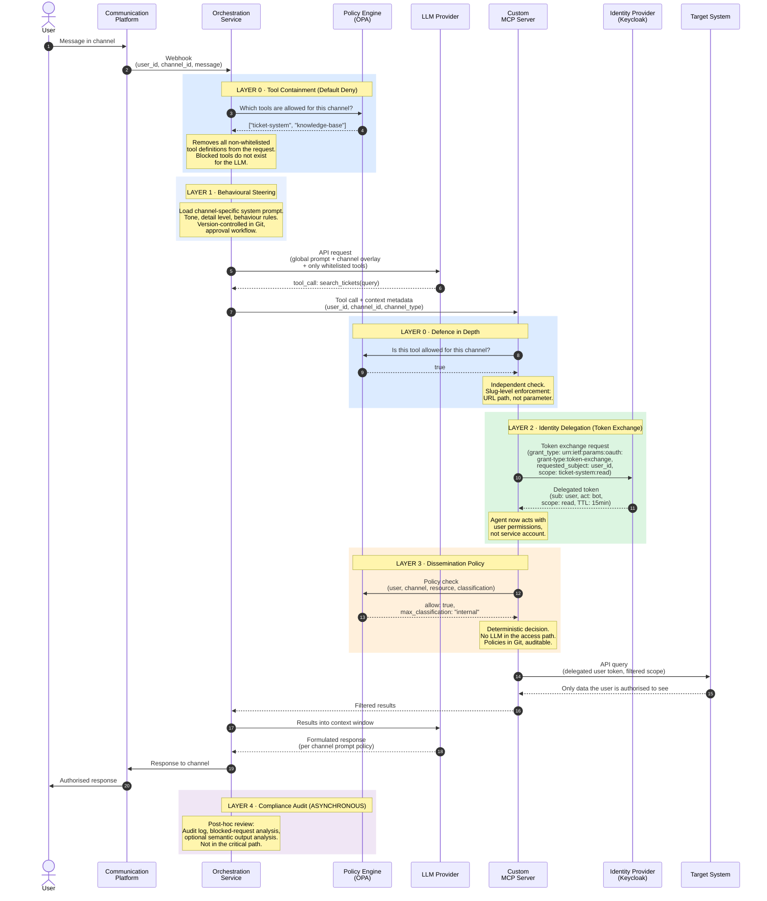
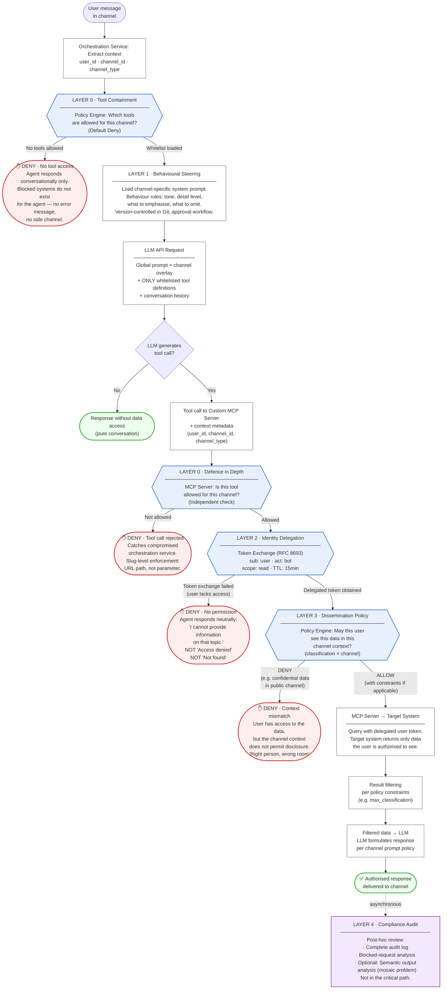

# Dissemination Control for AI Agents
## Architecture Blueprint: Context-Aware Governance with Identity Delegation

**Version:** 0.7 — Reference Architecture  
**Author:** Andre Jahn, Jahn Consulting  
**Date:** September 2026  
**License:** CC BY-SA 4.0

---

## Abstract

AI agents in enterprise environments access data sources and communicate across channels with different audiences. Existing security models cover authentication and authorisation but do not address a third question: **Which of the accessed data may the agent share in which context?**

This blueprint defines an architecture for Dissemination Control — a governance layer that ensures AI agents follow context-dependent rules about what information they may reveal, to whom, and through which channel. It is vendor-neutral, builds on existing IAM infrastructure, and requires no global data classification effort. It provides an extensible framework that operators can adapt to their own requirements, including complex governance models, and extend with additional tools, rules, and checks as those requirements evolve.

Core governance controls have been validated in a live reference environment with real integrations; the Reference Implementation section records the validation status. The architecture is designed for incremental adoption — from basic tool containment to full identity delegation with policy-engine integration, including controlled delegation to subagents.

---

## The Problem

### The Three-Layer Gap

| Layer | Question | Status |
|---|---|---|
| Authentication | Who is the agent? | Solved (OAuth2, service accounts) |
| Authorisation | What may it access? | Solved (IAM, RBAC, ABAC) |
| **Dissemination Control** | **What may it say where?** | **Open** |

Authentication and authorisation are well-understood problems with mature solutions. Dissemination Control is not. It addresses a fundamentally different question: not whether the agent *can* access data, but whether it *should share* that data in a given context.

### Why Existing Models Do Not Solve This

A human employee with access to HR data and project data does not post salary information in the public team channel. Not because IAM prevents it — they have read access — but because they understand the social context.

AI agents decide based on **relevance**, not **confidentiality**. The most helpful answer to a harmless question is often the one containing sensitive information. This is not a bug in the model. It is a structural mismatch between how LLMs optimise (maximise helpfulness) and how organisations need information to flow (minimise inappropriate disclosure).

### Why This Matters Now

Three trends are converging:

1. **MCP (Model Context Protocol) is becoming the standard for tool integration.** Agents are no longer limited to text generation — they call APIs, query databases, create tickets, and modify documents.
2. **Agents are being deployed in multi-user, multi-channel environments.** The same agent serves public channels, internal team channels, and private messages — each with different confidentiality expectations.
3. **Off-the-shelf MCP servers use single-identity, full-access tokens.** They have no concept of per-user permissions, channel context, or dissemination policy. Every tool call runs with the same god-mode credentials.

The attack surface is expanding faster than governance frameworks can keep up. Guardrail providers (Lakera, Prompt Armor, et al.) protect the model — input validation, prompt injection detection, output filtering. They do not address the infrastructure-level question: **How does the agent fit into your existing identity, permission, and compliance landscape?**

### Typical Failure Scenario

An AI bot with access to a ticket system operates in a team communication platform. In a public channel, someone asks "How is the project going?" — the bot delivers a helpful summary including confidential budget details and personnel decisions. Not because it was compromised, but because it was trying to be helpful. No prompt injection, no jailbreak, no vulnerability. Just an agent doing exactly what it was designed to do, in a context where it should not.

---

## Architecture Overview

### Core Principle

The agent does not have permissions. The **task** has permissions. By default, the agent acts on behalf of a specific user, inherits that user's permissions via delegation, and data access is scoped per request to the relevant context. The operator may separately approve dedicated specialist tools with extended permissions and explicit return rules, as defined in [Subagent Handling in Dissemination Control](#subagent-handling-in-dissemination-control). What the agent cannot see, it cannot leak.

### Design Principles

1. **Default Deny / Whitelist** — No tool, no system, no data source is available until explicitly enabled for a given context. Do not filter results — prevent requests. What is not whitelisted does not exist for the agent.
2. **No global data classification required** — Permissions are derived from existing IAM structures. Existing project roles, group memberships, and access policies serve as implicit classification.
3. **User identity by default** — The agent inherits the requesting user's permissions via token exchange. Exceptions require dedicated, operator-approved tools with explicit access and return rules; users cannot request or activate those extended permissions through self-service.
4. **Task-scoped tokens** — Short-lived, purpose-bound credentials instead of persistent god-mode tokens.
5. **Defence in depth** — Multiple independent enforcement points. If one is bypassed, the next catches it.
6. **Existing infrastructure, new wiring** — No new products. The architecture composes existing components (identity providers, policy engines, API gateways) in a new pattern.
7. **Explicit enablement, auditable by design** — Every tool enablement for a given context requires approval, is version-controlled, and produces an audit trail automatically.
8. **Extensible by design** — Operators can add tools, rules, and checks throughout the architecture's lifecycle. The framework supports organisation-specific requirements and complex combinations of policies, workflows, and enforcement points.

### Extensibility and Operator-Specific Requirements

The blueprint defines a framework for composing governance controls. Its examples provide starting points that operators can adapt and extend to match their systems, processes, and requirements.

Extension points include:

- **Tools and integrations:** Additional data sources, services, specialist agents, and execution environments.
- **Rules and policies:** Organisation-specific combinations of identities, roles, audiences, task purposes, and exceptions, including complex approval and escalation workflows.
- **Checks and processing stages:** Additional validation, authorisation, review, or monitoring steps before, during, and after execution.

These extensions can be introduced at any stage of adoption. Their scope, implementation, and operating parameters are operator decisions. They follow the same controlled enablement, versioning, enforcement, and audit principles as the existing components, with authoritative rules managed outside the LLM.

Message schemas and workflows can also be extended. Any added execution-relevant fields remain covered by the message's integrity protection and are validated by the responsible enforcement components.

---

## Governance Layers

The architecture defines five governance layers. Not every organisation needs all five. The layers are ordered by implementation complexity and can be adopted incrementally.

### Layer 0: Tool Containment (Default Deny)

**What it does:** Controls which tools the agent can see and invoke, per context. Tools not on the whitelist are removed from the LLM request entirely — the agent does not know they exist.

**Why it matters:** This is the most effective single measure against information leakage. If the agent cannot call the HR system, it cannot leak HR data. No request means no leak, no error message, no side channel revealing that the system exists.

**How it works:**

1. Before each LLM request, the orchestration service queries the policy engine: "Which tools are allowed for this channel?"
2. Only whitelisted tool definitions are included in the LLM request. All others are omitted.
3. The agent operates in a world where blocked systems do not exist.
4. As defence in depth, the MCP server validates the whitelist again on every incoming tool call — even if the orchestration service is compromised.

**Enforcement mechanism:** Policy engine rules (e.g., OPA/Rego), evaluated at the orchestration service and again at the MCP server. Both checks are mandatory.

**Slug-level enforcement:** Tool identifiers are embedded directly in MCP server URL paths (API slugs), not passed as string parameters. This prevents prompt-based circumvention — an attacker who manipulates the agent's tool-call parameters cannot redirect requests to a different system because the target system is determined by the URL route, not by a parameter the LLM controls.

```
Channel: #sales-team
  Allowed tools: [ticket-system, knowledge-base]
  Blocked tools: [hr-system, finance-system, code-repository]
  → Agent sees only ticket-system and knowledge-base
  → Agent cannot reference, query, or acknowledge hr-system

Channel: direct-message
  Allowed tools: [ticket-system, knowledge-base, hr-system(own-data)]
  → Agent can access HR data, but only the requesting user's own records
```

### Layer 1: Behavioural Steering (Prompt Policy)

**What it does:** Controls how the agent behaves within its permitted tool and identity scope. This is not configuration — it is a formal governance layer that sits between tool containment and identity delegation.

**Why it matters:** Tool containment controls what the agent *can do*. Behavioural steering controls what it *chooses to do* within those boundaries. An agent with access to a ticket system can still be overly verbose, share more detail than appropriate for the channel, or adopt a tone that is inappropriate for the audience.

**How it works:**

A two-level prompt system:

1. **Global system prompt** — Defines the agent's base personality, safety constraints, and organisation-wide policies. Applies to all channels.
2. **Channel-specific prompt overlays** — Define context-appropriate behaviour: level of detail, tone, what to emphasise, what to omit. A public channel gets a concise, non-technical persona. An engineering channel gets a detailed, technical one. A direct message can be more personal and comprehensive.

**Governance model:** The global prompt is controlled by the platform administrator. Channel-specific overlays can be delegated to channel owners within boundaries defined by the admin layer — self-service within guardrails.

**This is not just "prompt engineering."** It is a policy layer with version control, audit trail, and approval workflows. Changes to the global prompt or channel overlays follow the same governance process as tool enablement changes. They are stored in Git, reviewed, and deployed through the same pipeline as policy-engine rules.

### Layer 2: Identity Delegation

**What it does:** Establishes the standard access path: source-system requests use the requesting user's permissions. Dedicated, operator-approved specialist tools are explicit exceptions governed by their own access and return rules; see [Access, Delegation, and Return Permissions](#access-delegation-and-return-permissions).

**Why it matters:** Without identity delegation, the agent operates with a single set of credentials — typically a service account with broad read access. This means every user gets the same data, regardless of their actual permissions. Identity delegation ensures that when user A asks a question, the agent queries the target system as user A, and the target system's native permission model determines what data is returned.

**How it works:**

1. The orchestration service authenticates the requesting user via the communication platform.
2. For each tool call, the MCP server performs a token exchange with the identity provider: "Issue a short-lived token for user A, scoped to read access on the ticket system."
3. The identity provider validates: Is the agent allowed to act on behalf of user A? Does user A have access to the requested system?
4. The MCP server uses the delegated token to query the target system. The target system returns only data that user A is authorised to see.

**Token properties:**
- Subject: The requesting user (not the bot)
- Actor: The agent service (for audit trail)
- Scope: Minimal necessary (e.g., read-only on a specific system)
- TTL: Short-lived (e.g., 15 minutes)

**Standard:** OAuth 2.0 Token Exchange (RFC 8693). Supported by most enterprise identity providers (Keycloak, Entra ID, Okta, Auth0).

**Information disclosure prevention:** When a user lacks access, the agent responds with a neutral message ("I cannot provide information on that topic") — not "access denied" (confirms the resource exists) and not "not found" (misleading). The specific wording is a policy decision per deployment.

### Layer 3: Dissemination Policy Engine

**What it does:** Enforces context-dependent rules about what data may be shared in which channel, beyond what tool containment and identity delegation provide.

**Why it matters:** Tool containment is coarse-grained (system-level visibility). Identity delegation is user-scoped (what the user can see). Dissemination policy is context-scoped: even if the user has access to confidential data, should it be surfaced in a public channel?

**How it works:**

The MCP server queries the policy engine with the full context — user identity, channel, requested resource, resource classification — and receives a decision: allow, deny, or allow with constraints.

```
Input:
  user: user-a
  channel: public-channel
  resource: ticket SALES-2026
  classification: internal

Policy evaluation:
  → Public channels may only surface data classified as "public"
  → SALES-2026 is classified as "internal"
  → Decision: DENY

Same request, private channel:
  → Private channels may surface "public" and "internal" data
  → Decision: ALLOW
```

**Policy expression:** Policies are written as code (e.g., Rego for OPA), stored in Git, version-controlled, and deployed through CI/CD. This makes every policy change auditable and reversible. The policy engine makes deterministic decisions — no LLM involved in the access control path.

**Key distinction from Layer 0:** Tool containment is binary — the tool exists or it does not. Dissemination policy is graduated — the tool exists, but its responses are filtered based on context. Both are necessary. Tool containment prevents the request; dissemination policy filters the result.

### Layer 4: Compliance Audit (Async)

**What it does:** Provides asynchronous monitoring, audit logging, and — for high-security environments — semantic output analysis.

**Why it matters:** Layers 0–3 are preventive. Layer 4 is detective. It catches what the preventive layers missed, provides the evidence trail for compliance audits, and enables continuous improvement of the policy set.

**Components:**

- **Audit log:** Every tool call, every policy decision (allow and deny), every token exchange. Who asked, which channel, which tool, what was returned, what was blocked. This log is the compliance backbone.
- **Blocked-request logging:** Denied requests are logged with full context. This serves two purposes: security monitoring (detecting probing attempts) and policy tuning (identifying overly restrictive rules).
- **Semantic output analysis (optional, high-security):** A separate LLM reviews agent responses asynchronously for policy violations that the rule-based layers cannot catch — e.g., the agent inferring confidential information from public data (the mosaic problem). This is an escalation layer, not a blocking layer. It flags for human review.

---

## Three-Tier Governance Model

The five layers above describe *what* is enforced. The governance model describes *who controls what*.

### Admin Tier

The platform administrator defines the boundaries:

- Which channels exist and what their security classification is
- Which tools are available in the platform at all (the global tool catalogue)
- The global system prompt and non-negotiable safety constraints
- Which policy rules apply organisation-wide
- Who may approve tool enablement requests
- Which dedicated specialist tools may use extended permissions, for which tasks, and with which return rules

### User Tier (Self-Service Within Boundaries)

Channel owners and team leads operate within the boundaries set by the admin tier:

- Request tool enablement for their channel (subject to approval workflow)
- Customise the channel-specific prompt overlay within admin-defined guardrails
- Configure notification preferences for their channel's agent interactions

**The principle:** The admin tier defines the ceiling. The user tier configures the room within that ceiling. A channel owner cannot enable a tool that the admin has not made available, and cannot override the global prompt's safety constraints. Dedicated tools with extended permissions are outside this self-service process; their enablement is an operator decision.

### IAM Tier (Hard Ceiling)

The identity provider and target system permissions form the ultimate enforcement boundary for the approved execution identity. On the standard path, the target system only returns what the requesting user's IAM permissions allow. A dedicated specialist tool may use a separately authorised identity under an explicit operator approval; its source-system permissions still bound access, and Dissemination Control enforces the approved return scope. Existing enterprise permissions remain the access boundary in both cases.

```
Admin tier:     "Ticket system is available for the sales channel"
User tier:      "Enable ticket system for #sales-team" (approved)
Prompt policy:  "In #sales-team, provide concise status updates, no budget details"
IAM tier:       "User A has read access to projects SALES-2026 and MARKETING-Q1"
                "User B has read access to MARKETING-Q1 only"

Result: Same channel, same question, different answers — 
        and the agent's tone matches the channel's purpose.
```

---

## Component Architecture

The architecture comprises six component roles. Each role can be fulfilled by different products depending on the organisation's existing infrastructure.

### Communication Platform
The channel through which users interact with the agent. Provides user identity, channel context, and message routing.

### Orchestration Service
The central coordination layer. Receives user messages, resolves context (user, channel), queries the policy engine for tool permissions, constructs the LLM request with only permitted tools, and routes tool calls to the appropriate MCP server.

### LLM Provider
The language model that generates responses and tool calls. Receives only the tools and data that the governance layers have approved. It operates in a constrained world — what it cannot see, it cannot leak.

### Custom MCP Server (Policy Enforcement Point)
The critical enforcement layer. Sits between the LLM's tool calls and the target systems. Performs defence-in-depth whitelist validation, token exchange, scope filtering, and policy-engine queries. This component *must* be custom-built — off-the-shelf MCP servers lack identity delegation, context awareness, and policy integration.

### Identity Provider
Manages user identities, group memberships, and token exchange. Issues delegated tokens that allow the agent to act with a specific user's permissions for a specific scope and duration.

### Policy Engine
Evaluates context-dependent rules deterministically. Stores policies as code in version control. Provides the tool whitelist per channel, the data-level dissemination rules, and the audit log of all decisions.

### Component Interaction Flow

```
1. User sends message in a channel
   → Orchestration service receives: user identity, channel context, message

2. Orchestration service queries policy engine
   → "Which tools are allowed for this channel?"
   → Policy engine returns: [ticket-system, knowledge-base]
   → All other tools are excluded from the LLM request

3. Orchestration service constructs LLM request
   → System prompt: global + channel-specific overlay
   → Conversation history
   → ONLY permitted tool definitions
   → NO raw data from target systems

4. LLM generates tool call
   → tool: search_tickets
   → params: { query: "Project SALES-2026 status" }
   → LLM CANNOT call hr-system (not in its tool list, does not know it exists)

5. Orchestration service routes tool call to MCP server
   → Tool call parameters (from the LLM)
   → Context metadata (user identity, channel, timestamp)

6. MCP server: defence-in-depth whitelist check
   → Is "ticket-system" allowed for this channel? Yes → proceed. No → reject.
   → Enforcement at URL slug level, not parameter level

7. MCP server: token exchange with identity provider
   → "Issue a token for user-a, scoped to ticket-system:read"
   → Identity provider validates delegation permission and user access
   → Returns short-lived delegated token (TTL: 15 min)

8. MCP server: policy engine query (if Layer 3 is active)
   → "May user-a see ticket SALES-2026 in this channel context?"
   → Policy engine evaluates channel classification, resource classification
   → Returns: allow / deny / allow with constraints

9. MCP server queries target system
   → Authenticated with delegated token (user-a's permissions)
   → Target system returns only data user-a may see

10. Results return to LLM
    → Only filtered, authorised data enters the context window
    → LLM formulates response

11. Response delivered to user in the original channel
```

<details>
<summary>Sequence Diagram: Request Flow with Enforcement Points</summary>


```mermaid
sequenceDiagram
    autonumber

    actor User
    participant CP as Communication<br/>Platform
    participant Orch as Orchestration<br/>Service
    participant PE as Policy Engine<br/>(OPA)
    participant LLM as LLM Provider
    participant MCP as Custom<br/>MCP Server
    participant IdP as Identity Provider<br/>(Keycloak)
    participant TS as Target System

    User ->> CP: Message in channel

    CP ->> Orch: Webhook<br/>(user_id, channel_id, message)

    rect rgb(220, 235, 255)
        Note over Orch, PE: LAYER 0 · Tool Containment (Default Deny)
        Orch ->> PE: Which tools are allowed for this channel?
        PE -->> Orch: ["ticket-system", "knowledge-base"]
        Note over Orch: Removes all non-whitelisted<br/>tool definitions from the request.<br/>Blocked tools do not exist<br/>for the LLM.
    end

    rect rgb(232, 240, 254)
        Note over Orch: LAYER 1 · Behavioural Steering
        Note over Orch: Load channel-specific system prompt.<br/>Tone, detail level, behaviour rules.<br/>Version-controlled in Git,<br/>approval workflow.
    end

    Orch ->> LLM: API request<br/>(global prompt + channel overlay<br/>+ only whitelisted tools)
    LLM -->> Orch: tool_call: search_tickets(query)

    Orch ->> MCP: Tool call + context metadata<br/>(user_id, channel_id, channel_type)

    rect rgb(220, 235, 255)
        Note over MCP, PE: LAYER 0 · Defence in Depth
        MCP ->> PE: Is this tool allowed for this channel?
        PE -->> MCP: true
        Note over MCP: Independent check.<br/>Slug-level enforcement:<br/>URL path, not parameter.
    end

    rect rgb(220, 245, 225)
        Note over MCP, IdP: LAYER 2 · Identity Delegation (Token Exchange)
        MCP ->> IdP: Token exchange request<br/>(grant_type: urn:ietf:params:oauth:<br/>grant-type:token-exchange,<br/>requested_subject: user_id,<br/>scope: ticket-system:read)
        IdP -->> MCP: Delegated token<br/>(sub: user, act: bot,<br/>scope: read, TTL: 15min)
        Note over MCP: Agent now acts with<br/>user permissions,<br/>not service account.
    end

    rect rgb(255, 240, 220)
        Note over MCP, PE: LAYER 3 · Dissemination Policy
        MCP ->> PE: Policy check<br/>(user, channel, resource, classification)
        PE -->> MCP: allow: true,<br/>max_classification: "internal"
        Note over MCP: Deterministic decision.<br/>No LLM in the access path.<br/>Policies in Git, auditable.
    end

    MCP ->> TS: API query<br/>(delegated user token, filtered scope)
    TS -->> MCP: Only data the user is authorised to see

    MCP -->> Orch: Filtered results
    Orch ->> LLM: Results into context window
    LLM -->> Orch: Formulated response<br/>(per channel prompt policy)

    Orch ->> CP: Response to channel
    CP ->> User: Authorised response

    rect rgb(240, 230, 245)
        Note over Orch, PE: LAYER 4 · Compliance Audit (ASYNCHRONOUS)
        Note over Orch: Post-hoc review:<br/>Audit log, blocked-request analysis,<br/>optional semantic output analysis.<br/>Not in the critical path.
    end
```

</details>

### Divergent Scenario: User Without Access

```
User-b asks the same question in the same channel.

Step 7: Token exchange for user-b
  → Identity provider: user-b has no access to project SALES-2026
  → Token issued with restricted scope
  → Target system returns no results

Step 10-11: LLM responds:
  → "I cannot provide information on that topic."
  → NOT "You don't have access" (confirms resource exists)
  → NOT "Project not found" (misleading)
```

---

## Defence in Depth

Each enforcement point operates independently. If one layer is bypassed — through misconfiguration, compromise, or a novel attack — the next layer catches it.

```
Layer 0: Tool Containment
├── Policy engine defines which tools are visible per channel
├── Orchestration service removes non-whitelisted tools from LLM request
├── LLM does not know blocked systems exist
├── No request = no leak, no error message, no side channel
├── MCP server validates whitelist again (independent check)
├── Enforcement at URL slug level prevents parameter-based circumvention
└── New tool enablements require approval workflow

Layer 1: Behavioural Steering
├── Global system prompt defines safety boundaries
├── Channel-specific overlays control verbosity, tone, detail level
├── Prompt policies version-controlled in Git
└── Changes follow same approval process as tool enablements

Layer 2: Identity Delegation
├── Token exchange via identity provider
├── User permissions, not bot permissions
├── Short-lived, task-scoped tokens
└── Target system enforces its native permission model

Layer 3: Dissemination Policy
├── Context-dependent data filtering (channel × user × classification)
├── Deterministic policy decisions (no LLM in the access path)
├── Policies as code, auditable, version-controlled
└── Graduated: not just allow/deny, but allow-with-constraints

Layer 4: Compliance Audit
├── Complete audit log (allowed and denied requests)
├── Blocked-request analysis for security and policy tuning
└── Optional: async semantic output analysis for high-security environments
```

<details>
<summary>Flowchart: Enforcement Points and Denial Paths</summary>


```mermaid
flowchart TD
    Start(["User message<br/>in channel"]) --> Extract["Orchestration Service: Extract context<br/>user_id · channel_id · channel_type"]

Extract --> S0{{"LAYER 0 · Tool Containment<br/>─────────────────────────<br/>Policy Engine: Which tools<br/>are allowed for this channel?<br/>(Default Deny)"}}

S0 -->|"No tools allowed"| D0(["✋ DENY · No tool access<br/>Agent responds conversationally only.<br/>Blocked systems do not exist<br/>for the agent — no error message,<br/>no side channel."])

S0 -->|"Whitelist loaded"| S1["LAYER 1 · Behavioural Steering<br/>─────────────────────────────<br/>Load channel-specific system prompt.<br/>Behaviour rules: tone, detail level,<br/>what to emphasise, what to omit.<br/>Version-controlled in Git, approval workflow."]

S1 --> LLM["LLM API Request<br/>─────────────────<br/>Global prompt + channel overlay<br/>+ ONLY whitelisted tool definitions<br/>+ conversation history"]

LLM --> ToolCall{"LLM generates<br/>tool call?"}

ToolCall -->|"No"| DirectResp(["Response without data access<br/>(pure conversation)"])

ToolCall -->|"Yes"| MCP["Tool call to Custom MCP Server<br/>+ context metadata<br/>(user_id, channel_id, channel_type)"]

MCP --> S0b{{"LAYER 0 · Defence in Depth<br/>──────────────────────────<br/>MCP Server: Is this tool<br/>allowed for this channel?<br/>(Independent check)"}}

S0b -->|"Not allowed"| D0b(["✋ DENY · Tool call rejected<br/>Catches compromised<br/>orchestration service.<br/>Slug-level enforcement:<br/>URL path, not parameter."])

S0b -->|"Allowed"| S2{{"LAYER 2 · Identity Delegation<br/>────────────────────────────<br/>Token Exchange (RFC 8693)<br/>sub: user · act: bot<br/>scope: read · TTL: 15min"}}

S2 -->|"Token exchange failed<br/>(user lacks access)"| D2(["✋ DENY · No permission<br/>Agent responds neutrally:<br/>'I cannot provide information<br/>on that topic.'<br/>NOT 'Access denied'<br/>NOT 'Not found'"])

S2 -->|"Delegated token obtained"| S3{{"LAYER 3 · Dissemination Policy<br/>─────────────────────────────<br/>Policy Engine: May this user<br/>see this data in this<br/>channel context?<br/>(classification × channel)"}}

S3 -->|"DENY<br/>(e.g. confidential data<br/>in public channel)"| D3(["✋ DENY · Context mismatch<br/>User has access to the data,<br/>but the channel context<br/>does not permit disclosure.<br/>'Right person, wrong room'"])

S3 -->|"ALLOW<br/>(with constraints if applicable)"| Query["MCP Server → Target System<br/>──────────────────────<br/>Query with delegated user token.<br/>Target system returns only data<br/>the user is authorised to see."]

Query --> Filter["Result filtering<br/>per policy constraints<br/>(e.g. max_classification)"]

Filter --> Response["Filtered data → LLM<br/>LLM formulates response<br/>per channel prompt policy"]

Response --> Deliver(["✅ Authorised response<br/>delivered to channel"])

Deliver -.->|"asynchronous"| S4["LAYER 4 · Compliance Audit<br/>─────────────────────────<br/>Post-hoc review:<br/>· Complete audit log<br/>· Blocked-request analysis<br/>· Optional: Semantic output<br/>  analysis (mosaic problem)<br/>Not in the critical path."]

%% Styling
classDef deny fill:#fee,stroke:#c33,stroke-width:2px,color:#333
classDef allow fill:#efe,stroke:#3a3,stroke-width:2px,color:#333
classDef layer fill:#e8f0fe,stroke:#4a7bd4,stroke-width:2px,color:#333
classDef process fill:#fff,stroke:#666,stroke-width:1px,color:#333
classDef audit fill:#f3e8ff,stroke:#9b59b6,stroke-width:2px,color:#333

class D0,D0b,D2,D3 deny
class Deliver,DirectResp allow
class S0,S0b,S2,S3 layer
class S1,LLM,MCP,Query,Filter,Response,Extract process
class S4 audit
```

</details>

### The Mosaic Problem

Individual pieces of non-sensitive information can, in combination, yield confidential conclusions. Task-scoped access mitigates this — the context window contains only task-relevant data — but does not eliminate it entirely.

**Documented residual risk:** The architecture provides the same level of protection as a competent employee who receives the right files for the right task. For most enterprise contexts, this is an acceptable and defensible risk posture. For high-security environments, Layer 4 (semantic output analysis) provides additional detection capability.

---

## Knowledge Base Scoping

AI agents frequently access shared knowledge bases (wikis, documentation systems). Without scoping, the agent can search the entire knowledge base regardless of channel context — creating a cross-channel information leakage path that bypasses tool containment.

**Solution: Collection-level scoping.** The policy engine controls not just which knowledge base the agent can access, but which collections (spaces, folders, areas) within it. The sales channel's agent can search the "Sales" and "Product" collections but not "Engineering" or "HR Policies." This is enforced at the MCP server level, not as a prompt instruction — the query to the knowledge base includes a collection filter that cannot be overridden by the LLM.

```
Channel: #sales-team
  knowledge-base access: [Sales, Product, Public]

Channel: #engineering
  knowledge-base access: [Engineering, Architecture, Public]

Channel: direct-message
  knowledge-base access: [user-scoped — all collections the user has access to]
```

---

## Vector Store Integration (RAG)

Retrieval-Augmented Generation (RAG) uses a vector store to find semantically relevant content across large document collections. The agent queries the vector store with an embedding of the user's question, retrieves the most relevant chunks, and includes them in the LLM prompt as context.

This creates a governance challenge that is structurally different from direct system access.

### RAG Is an Independent System

When data from Confluence, Jira, SharePoint, or any other source is embedded into a vector store, it **leaves the authorisation context of the source system.** The source system no longer enforces anything. Its permissions do not apply. Its audit trails do not cover the data.

This is the critical distinction: when the agent queries Jira via Token Exchange (Layer 2), Jira enforces its native permission model. When the agent queries a vector store containing data _extracted from_ Jira, no one enforces anything — unless the architecture provides for it explicitly.

A vector store is a retrieval engine. It finds semantically similar chunks. It has no concept of users, roles, or permissions. Treating RAG as an extension of the source systems — by syncing ACLs into vector metadata, caching permissions at login, or replicating authorisation logic — creates a second source of truth that will inevitably drift from the original.

**Architectural principle: RAG is an independent system with its own authorisation model**, just like any other system that holds data. It is not an extension of Confluence, Jira, or SharePoint.

### Two Access Tiers

The architecture distinguishes two tiers of data access. Both are governed by the same five layers, but the authorisation basis differs.

|Tier|Access Pattern|Authorisation Basis|Granularity|
|---|---|---|---|
|**Direct Access**|Agent queries the source system via MCP + Token Exchange|Source system enforces its native permission model via delegated user token|Fine-grained (item-level, as defined by the source system)|
|**Knowledge Access (RAG)**|Agent queries a vector store containing extracted and embedded data|Classification attributes on each chunk, evaluated by the policy engine|Coarser (classification-level, as defined at ingestion)|

Direct Access (Tier 1 of the access model) is the preferred path when the source system is available and its API supports the required query. The source system retains full authority over permissions. Token Exchange (Layer 2) ensures per-user scoping. No additional classification effort is required.

Knowledge Access (Tier 2 of the access model) is used when semantic search across large document collections is required — the use case that RAG was designed for. The source system is not in the loop at query time. Authorisation depends entirely on the classification attributes assigned during ingestion and the policy engine's evaluation of those attributes against the user and channel context.

### Enforcement Architecture

The vector store has no native authorisation. The architecture provides it by placing a **Policy Enforcement Point in front of the vector store** — the same pattern used for any other system.

A dedicated MCP server mediates all agent access to the vector store. This MCP server:

1. Is subject to **Layer 0 (Tool Containment)** — the RAG tools are only visible in channels where they are explicitly whitelisted.
2. Passes retrieved chunks through the **policy engine (Layer 3)** — each chunk's classification attributes are evaluated against the user's identity and the channel context before the chunk enters the LLM prompt.
3. Logs all retrievals and policy decisions for **Layer 4 (Compliance Audit)**.

The agent does not interact with the vector store directly. What it cannot request, it cannot leak.

```
Channel: #sales-team
  RAG tools available: [search_sales, search_product]
  RAG tools not available: [search_engineering, search_hr]
  → Agent can semantically search sales and product documentation
  → Engineering and HR knowledge does not exist for the agent

Policy evaluation per chunk:
  Input: user, channel, chunk classification (org_unit, confidentiality, data_type)
  → chunk classified as org_unit: sales, confidentiality: internal → ALLOW in #sales-team
  → chunk classified as org_unit: hr, confidentiality: restricted → DENY (tool not even visible)
```

### Classification at Ingestion

Since the vector store has no native permissions, the classification attributes assigned during ingestion are the **sole basis for policy decisions** at query time. There is no second enforcement layer — unlike Direct Access, where the source system provides a safety net even if the policy engine is misconfigured.

This makes classification at ingestion a security-critical operation for RAG.

Classification attributes are properties of the data, not permissions of users — consistent with the principle established in the governance layers. Recommended minimum attributes per chunk:

- **Confidentiality level** (e.g., public, internal, restricted, confidential)
- **Organisational unit** (e.g., sales, engineering, hr, finance)
- **Data type** (e.g., documentation, policy, report, correspondence)
- **Source system** (e.g., confluence, sharepoint, jira)

The classification can be derived from the source system's structure (a Confluence space "HR Policies" implies org_unit: hr), assigned by automated rules during the ingestion pipeline, or reviewed manually for high-sensitivity sources. The appropriate method depends on the source system's data organisation — this is an implementation decision, not an architectural one.

### Re-Classification and Re-Embedding

When the classification of a data source changes — for example, a Confluence space is reclassified from "internal" to "restricted" — all chunks from that source must be re-embedded with updated classification attributes. A partial update is not sufficient: stale classification on even a single chunk is a potential policy bypass.

Re-embedding also addresses content freshness. The vector store's content is a snapshot taken at ingestion time. A TTL-based re-embedding schedule ensures that both classification and content remain current. The appropriate TTL depends on the data source's rate of change — this is a data governance decision, not a security architecture concern, and is outside the scope of this blueprint.

### Documented Residual Risk

RAG operates on a **coarser permission model** than Direct Access. This is a conscious architectural trade-off, not a gap:

- **Item-level permissions do not carry over.** Page-level overrides in Confluence, item-level security in SharePoint, or issue-level security schemes in Jira are not reflected in the vector store. If a source system contains documents with heterogeneous classification within the same structural unit (e.g., public and confidential documents in the same Confluence space), the classification at ingestion must account for this — either by classifying at document level rather than source level, or by excluding heterogeneous sources from RAG.
- **Classification quality is the security ceiling.** Misclassification at ingestion leads to incorrect policy decisions at query time. Unlike Direct Access, there is no source-system safety net. For high-sensitivity data, classification should include human review.
- **The source system is not consulted at query time.** Permission changes in the source system (e.g., a user losing access to a Confluence space) are not reflected in the vector store until re-embedding occurs. The staleness window equals the re-embedding interval.

These trade-offs are acceptable for knowledge-access use cases (searching documentation, finding precedents, exploring institutional knowledge) where the value of semantic search across large collections outweighs the loss of fine-grained source-system permissions. They are **not acceptable** for use cases where item-level access control is required — those should use Direct Access via Token Exchange.

### Systems With and Without Native Authorisation

The RAG integration highlights a broader architectural distinction that applies beyond vector stores:

|Category|Examples|Authorisation Enforcement|
|---|---|---|
|**Systems with native authorisation**|Jira, Confluence, SharePoint, ServiceNow|Source system enforces via delegated user token. Policy engine provides additional dissemination control. Two enforcement layers.|
|**Systems without native authorisation**|Vector stores, file systems, data lakes, object storage|Classification at ingestion + policy engine is the **sole** enforcement layer. No safety net.|

For systems without native authorisation, the quality of classification at ingestion and the correctness of policy-engine rules carry the entire security burden. This must be reflected in the governance process: tool enablement for RAG sources should require explicit acknowledgement that the source system does not provide independent enforcement.

---

## Channel Audience Scoping

Identity delegation (Layer 2) scopes the *query* to the requesting user's permissions. But the *response* is visible to everyone in the channel. If Anna asks about a confidential deal in a shared channel and receives details, every channel member can read the answer — including those who would not have access to the data themselves.

This is not a theoretical concern. It is the most common information leakage pattern in multi-user agent deployments: the data access is correctly scoped, but the output medium is not.

### Two Modes

The architecture defines two channel audience scoping modes. The choice between them is a policy decision per channel — not a global setting.

**Intersection Mode (conservative).** The agent may only return data that *all* channel members are authorised to see. The effective permission set is the AND-conjunction of all members' permissions — the lowest common denominator. Nothing enters the channel that any single member should not see.

This is the secure default for channels with mixed audiences: cross-functional teams, channels with external guests, or any context where the membership roster includes people with different clearance levels.

The tradeoff is restrictiveness. A single member with limited access lowers the permission ceiling for everyone. In practice, this is a feature, not a bug — it forces organisations to compose channel membership deliberately rather than defaulting to "everyone."

**Requester Mode (current model).** The agent responds based on the requesting user's permissions. More flexible, but the response is visible to all channel members, including those who would not have access to the underlying data.

This is acceptable for channels where all members have equivalent access levels — which is typically the case for well-designed team channels (the sales team channel contains sales team members, who all have access to sales data). It is not acceptable for mixed-audience channels.

### Implementation

Intersection mode requires the MCP server to know the channel's member list and resolve each member's permission set at query time. The effective permission set for the query is the intersection of all member permissions. This adds latency (one permission lookup per member) and complexity (the orchestration service must pass the member list to the MCP server).

For channels with stable membership, the intersection can be pre-computed and cached — updated only when channel membership changes. This reduces the runtime cost to a single cache lookup.

For direct messages, the distinction is irrelevant — there is only one recipient, so requester mode and intersection mode produce identical results.

### Policy Configuration

```
Channel: #town-square (public, all employees)
  audience_mode: intersection
  → Agent can only share data ALL employees may see
  → Effectively limits responses to public-classified data

Channel: #sales-team (private, sales team only)
  audience_mode: requester
  → All members have equivalent sales access
  → Requester mode is sufficient

Channel: #project-alpha (private, cross-functional)
  audience_mode: intersection
  → Mixed audience: sales, engineering, external consultant
  → Only data visible to ALL members (including the consultant) is returned

Channel: direct-message
  audience_mode: requester
  → Single recipient, modes are equivalent
```

---

## PII Protection Layer (GDPR Compliance Extension)

Layers 0–4 control what data the agent may *share*. The PII Protection Layer addresses a different question: **What data may enter the LLM context window at all?**

This is an independent concern. Even when a user is fully authorised to see personal data, and the channel context permits disclosure, routing that data through an external LLM may constitute a data processing operation under GDPR (or equivalent regulations). The data subject whose personal information is being processed has not consented to LLM inference — and in most cases, cannot.

The PII Protection Layer is orthogonal to the governance layers. It does not replace them. It adds a pre-processing and post-processing stage that ensures personal data is masked before it enters the LLM and restored (where appropriate) after the LLM has generated its response.

### Why Not Pseudonymisation?

The intuitive solution — replace real names with pseudonyms, let the LLM work with pseudonymised data, then re-personalise the output — does not scale in enterprise environments.

**Pseudonymised data is still personal data under GDPR.** Only fully anonymised data (irreversible, no mapping) falls outside GDPR scope. A reversible mapping table is, by definition, not anonymisation.

**Cross-document consistency requires a global mapping table.** In a RAG system that retrieves chunks from multiple documents, the same person must receive the same pseudonym everywhere. "Max Müller" in document A and "Max Müller" in document B must map to the same token — otherwise the LLM cannot reason across documents. This requires a central, enterprise-wide mapping table — itself a high-risk asset under GDPR.

**Entity resolution is an unsolved problem at scale.** "Max Müller", "Herr Müller", "the head of finance" — mapping these to the same pseudonym is not a lookup. It is enterprise-wide entity resolution with temporal dimensions: "the head of finance" was Müller before January 2026 and Schulze after. This requires a versioned knowledge graph, not a replacement table.

**Quality and risk grow proportionally.** The better the pseudonymisation, the more complete and valuable the mapping table — and the more attractive it becomes as an attack target.

**Right to erasure creates cascading obligations.** A deletion request requires cleanup across all systems: source documents, mapping table entries, vector store chunks, and cached responses.

**Pragmatic conclusion:** Full pseudonymisation across an enterprise data estate is not a viable path. The architecture uses selective masking with documented residual risk instead.

### Three-Tier Masking Pipeline

The masking pipeline operates on data *after* retrieval and policy filtering (Layers 0–3) but *before* the data enters the LLM context window. It runs entirely on-premise — no personal data leaves the organisation's infrastructure during masking.

| Tier | Method | Coverage | Risk |
|---|---|---|---|
| 1 | Regex patterns | Structured PII: email addresses, IBANs, phone numbers, tax IDs, social security numbers | None — deterministic |
| 2 | Local NER model (on-premise) | Person names, locations, organisations | Self-hosted processing, no data protection concern |
| 3 | Local language model (semantic) | Contextual personal references | Chicken-and-egg problem (see below) |

The tiers are applied sequentially. Each tier catches what the previous one missed. Tier 1 handles the easy cases with zero risk. Tier 2 handles named entities that regex cannot catch. Tier 3 attempts to catch references that are personally identifiable only in context.

**NER model selection matters.** For German-language business texts, model choice significantly affects masking quality. Empirical testing shows that NER models vary widely in their ability to handle honorific + surname patterns ("Herr Müller", "Frau Dr. Schulze") that are dominant in German business correspondence. Model evaluation against representative data is essential — do not assume that a model's benchmark scores translate to production accuracy on domain-specific text.

### The Chicken-and-Egg Problem

> "The colleague from accounting who had the incident last month"

This sentence contains no named entity. Regex finds nothing. NER finds nothing. Yet in context, it is personally identifiable — anyone in the organisation knows who is meant.

Detecting such references requires semantic understanding — which requires a language model. But routing the text through a language model for detection is precisely the data processing operation that the masking pipeline is meant to prevent.

**Possible mitigation:** A smaller, locally hosted language model performs semantic masking before the data is sent to the external LLM. The local model is under the organisation's full control and does not constitute third-party processing. Open question: whether current open-source models (European or otherwise) are capable enough for reliable semantic masking in domain-specific business texts.

**Documented residual risk:** Tier 3 coverage is probabilistic, not deterministic. Contextual personal references that the local model fails to detect will reach the external LLM. This risk must be documented in the organisation's data processing records and assessed against the specific data categories being processed.

### De-Masking (Post-LLM)

After the LLM generates its response based on masked data, certain masked tokens may need to be restored for the response to be useful. "PERSON_001 approved the budget" is not helpful to the requesting user.

De-masking is a policy decision, not an automatic reversal:

- **Full de-masking:** All masked tokens are restored. Appropriate when the requesting user is authorised to see the original PII and the channel context permits it (validated by Layers 2 and 3).
- **Selective de-masking:** Only specific token categories are restored (e.g., organisation names but not person names). Appropriate for mixed-sensitivity contexts.
- **No de-masking:** The response is delivered with masked tokens. Appropriate when the data is used for aggregation or analysis where individual identities are irrelevant.

The de-masking decision is evaluated by the policy engine using the same context (user, channel, classification) as Layers 2 and 3. The masking/de-masking table is held in memory for the duration of the request and discarded after response delivery — no persistent mapping table.

### Pipeline Position

```
Retrieval → Policy Filter (Layers 0-3) → PII Masking (Tiers 1-3) → LLM → De-Masking (policy-controlled) → Response to Channel
```

The PII Protection Layer sits between the policy filter and the LLM. It receives only data that has already passed all governance checks. It does not make access decisions — it protects data that has been approved for use from unnecessary exposure during LLM processing.

### Applicability

This extension is relevant for organisations operating under GDPR or equivalent data protection regulations that restrict the processing of personal data by third-party systems. It is not required for deployments using fully self-hosted LLMs where no personal data leaves the organisation's infrastructure.

The architecture supports both configurations: with PII Protection Layer (external LLM, regulated environment) and without (self-hosted LLM or non-regulated context). The governance layers (0–4) apply in both cases.

---

## Context Window Management as a Policy Decision

In long-running sessions, the agent's context window accumulates information from previous exchanges. This creates a governance problem: data that was legitimately accessed in turn 1 may still be in the context window when a different user (in a shared channel) asks a question in turn 15.

**Active forgetting is a policy decision, not just a technical optimisation.** The architecture treats context window management as a governance concern:

- **Per-turn context isolation:** Each request is processed with a fresh context, containing only the current user's identity and current channel's permitted data. Previous turns may be included for conversational continuity but are subject to the same policy evaluation.
- **Session boundaries:** Policy defines when a session resets — per user, per time window, or per topic change.
- **Context window degradation:** As the context window fills, the quality of the agent's responses degrades. The architecture treats this as a signal for session reset, not as a problem to be solved by expanding the window.

---

## Subagent Handling in Dissemination Control

**What it does:** Extends the governance chain to delegated tasks, including nested subagents, inter-agent communication, result submission, and correction attempts. Permissions and execution limits remain under operator control throughout the task lifecycle.

**Why it matters:** A main agent may delegate research or specialist work to other agents with different tools, models, or data access. Each delegation needs an authorised execution context, a verifiable instruction, and a controlled path for returning results.

This extension defines required properties and component responsibilities. The operator selects the products, tools, models, and operating parameters. Product names and limit values below are illustrative.

### Authorised Task and Processing Context

Dissemination Control admits only data approved for the task and its processing context. That approval includes processing by the permitted subagents and execution environments. The complete delegated context — including attachments and retained conversation history — must fall within that approval.

**No additional semantic confidentiality classification is required at each delegation.** The preventive controls determine which data may enter the context and which recipients and environments may process it. The main agent may use and pass on those data within that authorised scope. Existing audience-scoping and applicable PII-protection rules continue to apply.

Permissions, limits, and escalation rules are managed outside the LLM. They may be presented to the model as information, but the model cannot modify the authoritative configuration.

### Access, Delegation, and Return Permissions

The architecture distinguishes three permissions:

| Permission | Question |
|---|---|
| **Access** | Which information may this agent retrieve through its tools? |
| **Delegation** | Which specialist agents may it commission, and for which tasks? |
| **Return** | Which information may the specialist return, and to which recipients? |

**Standard path:** Tool adapters access source systems with the requesting user's credentials or delegated permissions. The target system enforces that user's access rights. Credential values are handled by the trusted runtime or tool adapter and remain outside the LLM context.

**Operator-approved exceptions:** The operator may enable dedicated tools with extended permissions for specific tasks. Users cannot request or activate these extended permissions through self-service. The operator defines the permitted use, execution identity, recipients, and return scope; Dissemination Control enforces that decision.

A specialist may therefore have access that its parent agent does not possess. The operator-approved task and tool configuration determines the specialist's permissions. Delegation cannot create permissions beyond that configuration, and the parent agent cannot grant itself or its children additional authority. The operator explicitly accepts the information flows enabled by an exception.

### Authorised and Signed Delegation

**How it works:**

1. The main agent invokes an enabled delegation tool, such as `launchSubAgent`, with the requested subtask.
2. The trusted tool implementation resolves the requesting user, parent task, and authorised context from system-controlled data. Dissemination Control evaluates the requested delegation.
3. The tool constructs the authoritative execution message, including permitted models, tools, limits, destinations, and the task prompt.
4. The tool signs the complete execution payload. The signing key remains outside the LLM's access.
5. At the receiving side, Dissemination Control verifies the signature, authorised issuer, intended recipient, validity, and applicable execution permissions. The consumer starts the subagent only after those checks and duplicate detection succeed.

**Signature scope:** All execution-relevant fields, including the message UUID, header, prompt, and context, are covered together. An unkeyed checksum is insufficient: a modified message could be accompanied by a newly calculated checksum. Signing and verification use the same defined representation, such as canonical JSON. The signature is carried separately from the signed payload.

Permitted signature profiles and verification keys come from trusted configuration. A message cannot establish its own trust merely by naming a key or policy. Referenced authorisation and execution profiles resolve to versioned or immutable definitions recorded with the decision. A valid signature establishes origin and integrity; execution still requires authorisation. Confidentiality of the message is a separate transport and storage concern.

### Example Execution Message

This example illustrates the message structure rather than prescribing a wire protocol. All identifiers, model aliases, policy references, and limits are illustrative operator configuration. The trusted tool produces the message after authorisation.

```json
{
  "payload": {
    "header": {
      "schemaVersion": "1.0",
      "messageId": "731ca9f4-6ed8-4b65-b7b2-d869c3a98451",
      "taskId": "research-subtask-002",
      "rootTaskId": "research-task-001",
      "parentAgentId": "main-agent-001",
      "executionAttempt": 1,
      "recipient": "subagent-launcher",
      "createdAt": "2026-09-27T10:00:00Z",
      "expiresAt": "2026-09-27T10:15:00Z",
      "authorization": {
        "initiatingUserId": "user-001",
        "authorizationContextRef": "auth-context-002",
        "policyVersion": "research-policy-v3"
      },
      "execution": {
        "agentRole": "document-research",
        "processingProfileRef": "approved-research-environment",
        "allowedModels": [
          "research-model-a",
          "research-model-b"
        ],
        "modelCredentialRef": "virtual-key-assignment-002"
      },
      "limits": {
        "timeoutMinutesPerAttempt": 15,
        "maxTokensPerAttempt": 100000,
        "maxQuestionsPerTask": 3,
        "maxRejectedResultsPerTask": 2,
        "maxSubagentsPerTaskTree": 3,
        "maxDelegationDepth": 2
      },
      "allowedTools": [
        {
          "toolName": "webSearch",
          "policyRef": "approved-web-research"
        },
        {
          "toolName": "launchSubAgent",
          "policyRef": "approved-research-delegation"
        },
        {
          "toolName": "askYourAgent",
          "recipientRef": "main-agent-001",
          "channelRef": "task-001-questions"
        },
        {
          "toolName": "deliverAnswer",
          "recipientRef": "result-validation",
          "channelRef": "task-002-submissions"
        }
      ],
      "output": {
        "stagingAreaRef": "task-002-working-results",
        "releasePolicyRef": "task-002-result-release"
      }
    },
    "prompt": {
      "promptText": "Research documents on the specified topic and prepare a summary with sources.",
      "context": {
        "topic": "Example topic",
        "requirements": [
          "Use the approved research tools.",
          "Identify unsupported statements.",
          "Submit the result through deliverAnswer."
        ]
      }
    }
  },
  "signature": {
    "profileRef": "approved-signature-profile",
    "keyId": "delegation-signing-key-01",
    "value": "<SIGNATURE_OF_CANONICAL_PAYLOAD>"
  }
}
```

**Reading the example:**

- `messageId` identifies this instruction. `taskId`, `rootTaskId`, and `parentAgentId` preserve the delegation chain; `executionAttempt` identifies the attempt within the subtask.
- `expiresAt` bounds acceptance of this execution message. `timeoutMinutesPerAttempt` separately limits the running attempt.
- `modelCredentialRef` identifies a runtime-managed credential assignment. The message contains no usable access token.
- `allowedTools` determines the available tool set. The referenced policies supply any further restrictions, such as permitted websites or specialist roles. Tool-call arguments remain subject to Dissemination Control checks.
- `stagingAreaRef` identifies the protected working area. `releasePolicyRef` governs result visibility after validation.
- `signature.value` is a placeholder. An implementation computes the signature over the complete canonicalised `payload`.

### Message Delivery and Duplicate Detection

Every new message receives a unique UUID. Retransmission of the same message preserves that UUID. A correction instruction receives a new UUID while retaining its relationship to the original task. The UUID is part of the signed payload.

The receiving tool or enforcement point detects duplicates before another execution can begin. Sender-side checks alone do not cover redelivery by the messaging system. Multiple consumers use a shared state store; checking and reserving an identifier must be atomic so that concurrent consumers cannot both treat the message as new.

The shared record retains processing state as well as the identifier. Duplicate records survive restarts for the relevant replay window. Recovery reconciles an interrupted attempt with its recorded execution state so that redelivery does not launch an additional agent or silently lose the original task. The operator selects the storage mechanism, retention, and recovery implementation.

### Execution, Questions, and Escalation

The subagent receives only its permitted tools. Dissemination Control checks every invocation, including further delegation and inter-agent communication. Messaging permissions enforce the authorised senders and recipients for the configured channels.

Questions to the parent agent use a dedicated tool, such as `askYourAgent`, and a defined communication path. Questions and replies are recorded and remain within the authorised information-sharing scope. The same controls apply at every delegation depth.

The operator configures limits for questions, rejected results, runtime, resource consumption, concurrent agents, total agents, and delegation depth. The configuration distinguishes limits per execution attempt from limits per task or complete task tree. Counters and limits are enforced outside the LLM; shared limits are coordinated across concurrent executions.

When an escalation threshold is reached, automated processing of the affected task stops and the issue is passed to the designated human authority. The operator defines the escalation destination and the conditions for resuming or ending the task.

### Result Submission and Release

Results are first written to a protected staging area. A tool such as `deliverAnswer` submits a specific result version for validation. Once that submission is durably recorded, the runtime ends the execution attempt.

**Quality acceptance and dissemination approval are separate decisions.** A parent agent may assess whether the work answers the question. Dissemination Control enforces the configured release conditions for the intended recipients. Quality acceptance cannot grant additional permissions.

The submitted version becomes visible to its intended recipients only after the required approvals. Access to the staging area is limited to authorised execution and validation components; the parent agent or user cannot bypass release through direct storage access. The policy-controlled release is part of preventive enforcement. Optional semantic monitoring in Layer 4 remains an asynchronous audit function.

### Correction Attempts and Context Restoration

If validation rejects a result, the subagent may be restarted for a correction attempt. It receives its previous context together with the identified deficiencies and correction instructions. The original authorised execution conditions and the same checks used for the first start apply again, including checks on the restored context.

The correction attempt receives a new signed execution message with a new `messageId` and incremented `executionAttempt`. Its `taskId` and `rootTaskId` remain unchanged. Task-level question and rejection counters persist across restarts. Time and resource budgets follow the operator's configured per-attempt and aggregate rules.

### Audit and Credential Traceability

The audit records agent communication, tool invocations, authorisation decisions, result versions, and lifecycle transitions. Events are correlated with the initiating user, root task, subtask, agent, and execution attempt.

Credential use remains identifiable through a token identifier and issuer, or a cryptographic fingerprint. Usable credential secrets are excluded or masked before entering ordinary audit records. Relevant authorisation metadata and policy decisions are retained. Token exchanges link the original and issued credential references; operator-approved exceptions identify the dedicated tool and its approval. This preserves the authorisation chain without exposing reusable credentials.

Model-provider access may be mediated through a gateway using virtual keys. In that configuration, agent runtimes use only virtual keys, provider credentials remain in the gateway's secret management, and model calls pass through the gateway. Credential references and request identifiers connect the model-usage records to the task audit and allow central cost attribution, including correction attempts.

### Operator Configuration and Implementation Examples

| Responsibility | Possible Implementation | Operator Decisions |
|---|---|---|
| Model access and cost accounting | LiteLLM or an equivalent gateway | Approved models and deployments, virtual-key assignments, budgets and rate limits |
| Agent messaging | NATS/JetStream or an equivalent messaging system | Channel permissions, delivery behaviour, message validity and retention |
| Duplicate detection and execution state | Shared database or durable cache | Atomic reservation, recovery, replay window and retention |
| Result storage | S3-compatible object storage or an equivalent repository | Task isolation, validation access, release rules and retention |
| Authorisation and signature verification | Existing policy and enforcement components | Tool grants, specialist exceptions, trusted issuers, keys and signature profiles |

These are implementation examples, not additions to the validated reference stack or mandatory product choices. The blueprint requires the stated control properties; the operator chooses how to implement them and supplies all concrete values. Additional tools, rules, checks, and workflow stages can be incorporated under the same [extensibility principles](#extensibility-and-operator-specific-requirements).

**Optional dry-run:** The system can expose the prepared delegation message, destination, context, and execution conditions for review without starting the subagent. It shows the planned instruction; later questions and further delegations arise during execution and undergo their own checks.

---

## Compliance Process for Tool Enablement

When a team requires access to an additional standard tool in its channel:

```
1. Request
   "Channel #sales-team requires access to the CRM system 
    (scope: customer contact data, read-only)"

2. Review (data protection / CISO)
   → What data becomes accessible?
   → Is the channel's participant scope appropriate?
   → Are there regulatory constraints?

3. Approval → Policy update
   → Version-controlled in Git
   → Audit trail of the change
   → Automated deployment via CI/CD

4. Effective immediately after policy deployment
   → No code change required
   → No agent restart required
   → Rollback via Git revert if needed
```

This process creates compliance by design: every tool enablement is documented, approved, and traceable. The audit trail is a natural byproduct of the Git-based policy deployment pipeline.

---

## Why Not Off-the-Shelf MCP Servers?

Off-the-shelf MCP servers (e.g., vendor-provided connectors for ticket systems, wikis, CRMs) typically use a single API token with broad access. They provide:

- No identity delegation (every user gets the same data)
- No scope filtering per request
- No context awareness (channel, audience, classification)
- No policy integration

They are suitable for single-user development environments and prototyping. For controlled data flows in multi-user enterprise environments, custom MCP servers with built-in policy enforcement are necessary.

**The architectural investment is in the MCP server layer** — this is where identity delegation, defence-in-depth validation, and policy-engine integration live. The orchestration service and policy engine are relatively straightforward. The MCP server is the component that makes or breaks the governance model.

---

## Adoption Tiers

Not every organisation needs the full architecture. The layers are designed for incremental adoption. Each tier adds exactly one governance capability to the previous one. This is critical: security is not all-or-nothing. Each step delivers measurable risk reduction, and the first step can be implemented in days.

### Baseline: Ungoverned (the status quo)

This is how most enterprises currently operate AI agents. A service account with broad access. All tools visible. All data returned to all users. The agent decides what to share based on relevance, not confidentiality. This is the default when using off-the-shelf MCP servers with a single API token.

**Risk profile:** Any user can receive any data the agent can access. Information leakage is not a possibility — it is the normal operating mode. The agent will helpfully share confidential data whenever it considers it relevant to the question.

### Tier 1: Tool Containment

- **Adds:** Layer 0 (tool containment) + Layer 1 (behavioural steering)
- **Identity:** Still a service account — no IAM integration required
- **What changes:** Tools are whitelisted per channel via policy engine. Tools not on the whitelist are removed from the LLM request entirely — the agent does not know they exist. Channel-specific prompt overlays control the agent's tone and verbosity.
- **What does NOT change:** Within the permitted tools, all users in the same channel see the same data. There is no per-user differentiation. If the ticket system is enabled for the sales channel, every user in that channel gets the same ticket data.
- **Risk reduction:** Eliminates cross-domain leakage. The agent in the sales channel cannot leak HR data because it cannot see the HR system. This alone removes the most dangerous class of information disclosure.
- **Suitable for:** Internal tools, prototyping, teams that want immediate risk reduction without IAM changes
- **Effort:** Days. Only requires policy-engine configuration and orchestration-service changes. No identity provider integration. No changes to target systems.
- **Key message for decision-makers:** This is what you can implement this week.

### Tier 2: Identity Delegation

- **Adds:** Layer 2 (identity delegation) on top of Tier 1
- **Identity:** User-scoped tokens via token exchange. The agent acts with the requesting user's permissions.
- **What changes:** When user A asks a question, the agent queries the target system as user A. The target system's native permission model determines what data is returned. Different users in the same channel, asking the same question, receive different answers.
- **What does NOT change:** No additional data classification or channel-level filtering beyond what the target system already enforces. If the user has access to confidential data, that data may appear in any channel where the tool is enabled.
- **Risk reduction:** Eliminates privilege escalation through the agent. A junior developer cannot use the agent to access data that their own credentials would not permit. The agent's access ceiling is always the requesting user's permission set.
- **Suitable for:** Organisations with existing IAM infrastructure (identity provider with token exchange support, target systems with permission-scoped APIs)
- **Effort:** Weeks. Requires identity provider configuration (token exchange), MCP server development for delegation, and user-identity mapping between communication platform and IAM.

### Tier 3: Dissemination Policy

- **Adds:** Layer 3 (dissemination policy engine) on top of Tier 2
- **Identity:** User-scoped tokens (same as Tier 2)
- **What changes:** Even when a user has access to data and the tool is enabled for the channel, the policy engine evaluates whether the data's classification is appropriate for the channel's context. Confidential data is suppressed in public or semi-public channels, even for authorised users. The same user, with the same permissions, sees different data scopes depending on which channel they ask from.
- **Risk reduction:** Addresses the "right person, wrong room" problem. An authorised user discussing sensitive data in a public channel is a policy violation that neither tool containment nor identity delegation catches. Dissemination policy closes this gap.
- **Suitable for:** Organisations with multi-classification environments where channel audience and data sensitivity must be matched
- **Effort:** Weeks to months. Requires data classification (can be derived from existing project structures), policy-engine rules for channel-classification matching, and MCP server integration with the policy engine for result filtering.
- **Additional capabilities at this tier:** Complete audit trail (including blocked requests), compliance process for tool enablements, blocked-request analysis for policy tuning.

### Tier 4: Compliance Monitoring

- **Adds:** Layer 4 (async compliance audit) on top of Tier 3
- **Identity:** User-scoped tokens (same as Tier 2/3)
- **What changes:** A separate monitoring layer reviews agent interactions asynchronously. Semantic output analysis detects policy violations that rule-based layers cannot catch — e.g., the agent inferring confidential information from a combination of non-confidential data points (the mosaic problem). Escalation workflows flag violations for human review.
- **Risk reduction:** Detective control on top of the preventive controls in Tiers 1–3. Catches what the rules missed. Provides evidence trail for regulatory audits.
- **Suitable for:** Critical infrastructure, healthcare, financial services, and any environment where regulatory bodies require demonstrable monitoring
- **Effort:** Months. Requires integration with existing compliance tooling, definition of escalation workflows, and ongoing tuning of the semantic analysis model.

### Progression Summary

```
Tier 1: Tool Containment          → "The agent can't see it"
Tier 2: + Identity Delegation     → "The agent sees only what you see"
Tier 3: + Dissemination Policy    → "The agent shares only what fits the context"
Tier 4: + Compliance Monitoring   → "Every action is audited and anomalies are flagged"

Each tier builds on the previous. Skip none.
```

---

## Prerequisites

### Infrastructure
- Central identity provider with token exchange support (e.g., Keycloak, Entra ID, Okta, Auth0)
- Self-hosted or controlled communication platform (e.g., Mattermost, Slack, Microsoft Teams)
- Target systems with OAuth2 or API token support and permission-based query capabilities

### Essential Conditions
- User identities in the communication platform must map to IAM principals (federation)
- Target systems must support permission-scoped API queries (project filters, role-based visibility)
- **No new data classification required** — existing project structures, role assignments, and access policies are interpreted as implicit classification

---

## Design Decisions and Known Limitations

The following items are deliberate architectural decisions or documented limitations, not open questions.

### MCP Context Metadata
MCP does not currently define a standardised field for request context (user identity, channel, classification). This architecture passes context metadata as explicit parameters in each tool call definition. This is verbose but debuggable. A future MCP specification may standardise this; the migration path would be straightforward.

### Mosaic Problem
The architecture mitigates but does not eliminate the risk that individually non-sensitive data points combine into sensitive conclusions. Mitigation: task-scoped access limits the data available for inference. Detection: Layer 4 semantic analysis can flag suspicious combinations. Elimination would require understanding the semantic implications of all possible data combinations — this is an unsolved problem in information security, not specific to AI agents.

### Policy Granularity
The blueprint defines policy at the channel level. Organisations with complex requirements may need role-based or group-based policies within channels, or hierarchical policy inheritance across channel groups. The policy-engine approach (code-based policies in Rego or equivalent) supports arbitrary granularity — the question is not technical feasibility but governance complexity.

### Performance Impact
Token exchange and policy-engine queries add latency to every request. Measured on the reference implementation: token exchange adds ~100-200ms, policy-engine query adds ~10-50ms. Total overhead per tool call is typically under 300ms — negligible relative to LLM inference time (1-5s). Caching strategies (token reuse within TTL, policy-decision caching) can reduce this further.

### Denial Response Wording
When a user lacks access, the agent's response must be carefully worded to avoid information disclosure. The specific wording ("I cannot help with that" vs. "I don't have information on that topic" vs. a topic-specific deflection) is a policy decision that must be defined per deployment. The architecture enforces the *decision*; the *content* of the denial is a prompt-policy concern (Layer 1).

### Context Window Across Users
In shared channels, the conversation history may contain data from other users' queries. The architecture recommends per-request context isolation for sensitive environments. For lower-sensitivity environments, shared conversation history within a channel is acceptable if all channel participants have equivalent access levels — which is typically the case by channel design.

### Agent-to-Agent Delegation
The [Subagent Handling in Dissemination Control](#subagent-handling-in-dissemination-control) extension defines the governance contract for multi-hop delegation: operator-approved permissions, signed execution messages, duplicate detection, controlled result release, and correction attempts with retained context. The wire protocol, products, operating limits, and escalation destinations are operator choices. The JSON message is illustrative; this architectural definition does not by itself establish implementation validation.

### RAG Permission Model
The architecture treats vector stores as independent systems with their own authorisation model based on classification attributes, rather than attempting to replicate source-system permissions. This is a deliberate trade-off: it sacrifices fine-grained, per-user, item-level permissions in exchange for a classification-based model that is maintainable, auditable, and independent of source-system availability. Organisations that require item-level access control for specific data should use Direct Access (Token Exchange) for that data rather than including it in the RAG pipeline.

---

## Reference Implementation

The architecture has been validated on the following stack. This is one possible implementation — the architecture is vendor-neutral and the component roles can be fulfilled by equivalent products.

| Component Role | Reference Implementation | Alternatives |
|---|---|---|
| Communication Platform | Mattermost (self-hosted) | Slack, Microsoft Teams |
| Orchestration Service | Custom bot service | Any middleware capable of LLM API calls and routing |
| LLM Provider | Anthropic Claude (API) | Any LLM with tool/function calling support |
| Custom MCP Server | Spring Boot / Maven | Any framework supporting HTTP + OAuth2 |
| Identity Provider | Keycloak v26 (Token Exchange Standard V2) | Entra ID, Okta, Auth0 |
| Policy Engine | OPA (Open Policy Agent) with Rego | Cedar, Casbin, custom |
| Target Systems | YouTrack, Outline, OpenProject, Notion | Jira, Confluence, ServiceNow, SAP |
| Search | Brave Search | Any web search API |

### Validated Scenarios

The following scenarios have been tested on the reference implementation:

- **Tool containment:** Agent in the sales channel sees only ticket system and knowledge base; cannot reference or acknowledge the HR system
- **Defence in depth:** Manually crafted tool call for a blocked system is rejected by the MCP server, even when bypassing the orchestration service's whitelist check
- **Channel differentiation:** Same question in public channel vs. private channel returns different data scopes
- **Slug-level enforcement:** Manipulated tool-call parameters cannot redirect requests to unintended target systems
- **Behavioural steering:** Same agent, different channels, different persona — concise in public, detailed in engineering, personal in DMs

### Scenarios Under Implementation

- **Identity delegation:** Token exchange flow designed, Keycloak configuration defined, end-to-end integration in progress
- **Policy-engine data filtering:** OPA policies written and unit-tested, integration with MCP server in progress
- **Collection-level knowledge base scoping:** Architecture defined, enforcement at MCP server pending

---

## Glossary

| Term | Definition |
|---|---|
| **Dissemination Control** | The governance layer that controls what information an AI agent may share in a given context, independent of access permissions |
| **Tool Containment** | Restricting which tools the agent can see and invoke, per context. Default deny: tools must be explicitly whitelisted. |
| **Identity Delegation** | The agent acts with the requesting user's permissions via token exchange, not with a service account |
| **Task-Scoped Token** | A short-lived credential issued for a specific user, system, and permission scope |
| **Token Exchange** | OAuth 2.0 mechanism (RFC 8693) for obtaining a token on behalf of another user |
| **Policy Enforcement Point (PEP)** | A component that enforces policy decisions — in this architecture, the custom MCP server |
| **Behavioural Steering** | Controlling agent behaviour through versioned, governance-controlled prompt policies |
| **Mosaic Problem** | The risk that individually non-sensitive data points combine into sensitive conclusions |
| **Context Window Isolation** | Processing each request with a fresh, policy-evaluated context rather than accumulating state |
| **Slug-Level Enforcement** | Embedding tool identifiers in URL paths rather than parameters to prevent prompt-based circumvention |
| **PII Protection Layer** | Pre-LLM masking and post-LLM de-masking pipeline that prevents personal data from entering external LLM context windows. Orthogonal to the governance layers (0–4). |
| **Chicken-and-Egg Problem** | Contextual personal references that require semantic understanding (i.e., an LLM) to detect — but the detection must happen *before* the data reaches the LLM |
| **Knowledge Access** | Data access via vector store (RAG), where the source system is not consulted at query time. Authorisation is based on classification attributes assigned at ingestion, not on the source system's native permission model. | 
| **Direct Access** | Data access via the source system's API using Token Exchange. The source system enforces its native permission model. Preferred when available. |
| **Classification at Ingestion** | The process of assigning security-relevant metadata (confidentiality level, organisational unit, data type) to each chunk when data is embedded into a vector store. For systems without native authorisation, this is the sole basis for policy decisions. |
| **Delegation Message** | An authorised, signed instruction that binds a subtask and its context to permitted execution conditions, recipients, and limits. |
| **Task Tree** | A root task and all tasks delegated beneath it. Shared limits and audit correlation can apply across the tree. |
| **Return Permission** | The operator-defined scope of information a specialist may return to specified recipients, evaluated separately from access and delegation permissions. |
| **Virtual Key** | A gateway credential used by an agent runtime for controlled model access and cost attribution while provider credentials remain at the gateway. |
| **Correction Attempt** | A new execution attempt for the same task, restoring prior context with correction instructions and applying the same authorisation checks. |

---

## License and Attribution

This work is licensed under [CC BY-SA 4.0](https://creativecommons.org/licenses/by-sa/4.0/). You may share and adapt it for any purpose, including commercial use, provided you give appropriate credit and distribute derivative works under the same license.

**Recommended citation:**  
Jahn, A. (2026). *Dissemination Control for AI Agents: Architecture Blueprint.* Jahn Consulting. https://jahnconsulting.io

---

*Jahn Consulting — AI Agent Governance Architecture*  
*jahnconsulting.io*